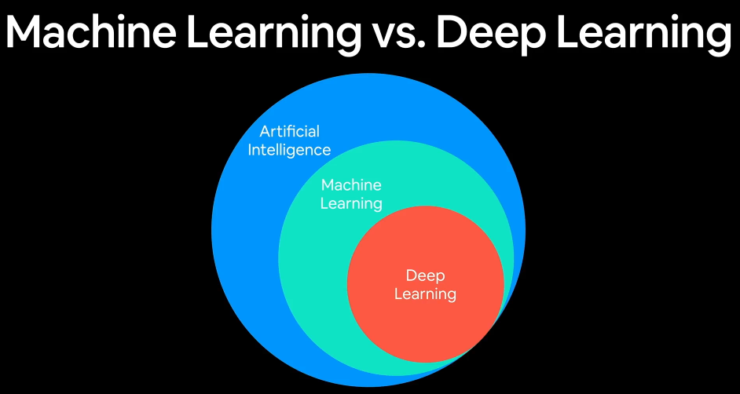
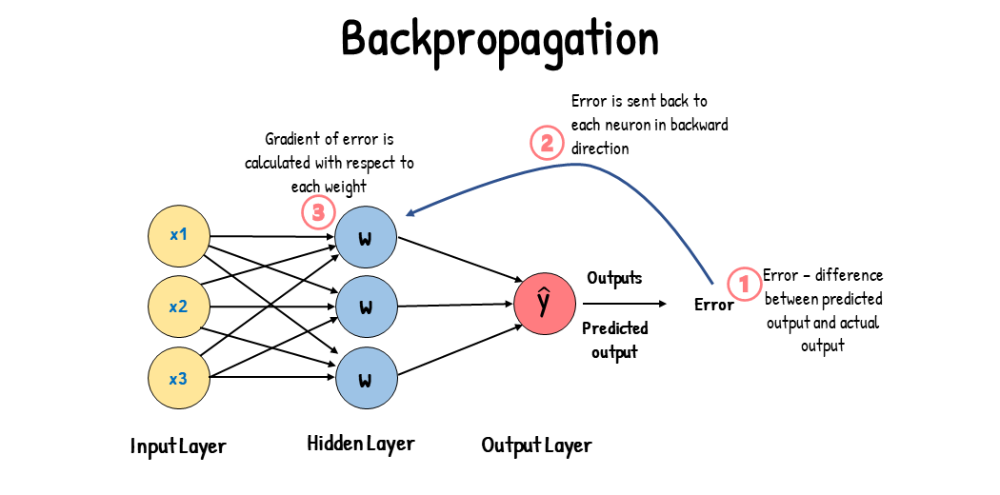

# Table of contents

- [Table of contents](#table-of-contents)
- [1. Deep learning with pytorch](#1-deep-learning-with-pytorch)
  - [Overview](#overview)
  - [What is deep learning (subset of machine learning)](#what-is-deep-learning-subset-of-machine-learning)
  - [Machine learning](#machine-learning)
- [3. Why use machine learning or deep learning](#3-why-use-machine-learning-or-deep-learning)
  - [Overview](#overview-1)
  - [simple rule-based system](#simple-rule-based-system)
- [4.1. What deep learning is good for?](#41-what-deep-learning-is-good-for)
  - [Overview](#overview-2)
  - [Problems with long lists of rules? When the traditional approanch fails | can't keep track](#problems-with-long-lists-of-rules-when-the-traditional-approanch-fails--cant-keep-track)
  - [Deep learning adapt long lists of rules](#deep-learning-adapt-long-lists-of-rules)
  - [Deep learning adapt continually changing enviroments](#deep-learning-adapt-continually-changing-enviroments)
  - [Discovering insights within large collections of data](#discovering-insights-within-large-collections-of-data)
- [4.2. What deep learning is not good for?](#42-what-deep-learning-is-not-good-for)
  - [Overview](#overview-3)
  - [Problems that need explainability](#problems-that-need-explainability)
  - [When the traditional approach is better options](#when-the-traditional-approach-is-better-options)
  - [When errors are unacceptable (dl model outputs aren't always predictable)](#when-errors-are-unacceptable-dl-model-outputs-arent-always-predictable)
  - [When you don't have much data](#when-you-dont-have-much-data)
- [5. Machine learning vs Deep learning](#5-machine-learning-vs-deep-learning)
  - [Overview](#overview-4)
  - [Can they work well together in the same pipeline or even in the same job?](#can-they-work-well-together-in-the-same-pipeline-or-even-in-the-same-job)
- [6. What are neural networks?](#6-what-are-neural-networks)
  - [Overview](#overview-5)
  - [Anatomy of neural networks](#anatomy-of-neural-networks)
  - [Layers](#layers)
  - [Weights and Connections](#weights-and-connections)
  - [Activation Function](#activation-function)
  - [Feedforward Propagation](#feedforward-propagation)
  - [Feedforward Propagation in details](#feedforward-propagation-in-details)
  - [Backpropagation](#backpropagation)
  - [Activation Layers, comparing with Activation function](#activation-layers-comparing-with-activation-function)
  - [Loss Function](#loss-function)
  - [Hyperparameters](#hyperparameters)
  - [Model Evaluation](#model-evaluation)
- [7. Type of learning](#7-type-of-learning)
  - [Overview](#overview-6)
  - [Supervised Learning in pytorch](#supervised-learning-in-pytorch)
  - [Unsupervised Learning (including Self-Supervised Learning) in pytorch](#unsupervised-learning-including-self-supervised-learning-in-pytorch)
  - [Transfer Learning in pytorch](#transfer-learning-in-pytorch)
  - [Reinforcement Learning in pytorch](#reinforcement-learning-in-pytorch)
- [9. What is PyTorch?](#9-what-is-pytorch)
  - [Overview and Why PyTorch?](#overview-and-why-pytorch)
- [10. What is a tensor?](#10-what-is-a-tensor)
  - [Overview](#overview-7)
- [11. What we're going to cover and how to approach pytorch deep learning?](#11-what-were-going-to-cover-and-how-to-approach-pytorch-deep-learning)

# 1. Deep learning with pytorch

<p align="center">
  
</p>

## Overview

- Mastering PyTorch, a **popular deep learning framework**, is a valuable skill for anyone interested in machine learning and artificial intelligence. 
- To go from zero to mastery in PyTorch, you should follow a structured learning path.

**1. Python Proficiency:**

   - If you're not already proficient in Python, start by learning the basics of Python programming. PyTorch is primarily used with Python, so a solid foundation in Python is essential.

**2. Understanding Deep Learning Concepts:**

   - Before diving into PyTorch, make sure you have a good understanding of deep learning concepts, including **neural networks**, **activation** functions, **backpropagation**, and **optimization** algorithms like **gradient descent**.

<p align="center">
   <p align="left">
   <td></td>
   <td></td>
   </p>
   <p align="left">
  <td></td>
  <td></td>
   </p>
</p>

**3. Installation:**
   - Install PyTorch on your system. You can do this by following the official installation instructions on the PyTorch website (https://pytorch.org/).

**4. PyTorch Basics:**
   - Start with the basics of PyTorch:
     - **Tensors**: Learn how to create and manipulate tensors, which are fundamental data structures in PyTorch.
     - **Autograd**: Understand PyTorch's automatic **differentiation** system, which makes it easy to **compute gradients** for training neural networks.
     - Basic **operations**: Practice basic tensor operations like **addition, multiplication**, and **reshaping**.

**5. Building Neural Networks:**
   - Learn how to **create and train** neural networks using PyTorch:
     - Define a simple **feedforward** neural network **architecture**.
     - Use PyTorch's **nn.Module and nn.Sequential** to build complex models.
     - Implement **forward and backward** passes.
     - **Train** a neural network on a simple dataset (e.g., MNIST).

**6. Data Loading and Preprocessing:**
   - Explore PyTorch's data loading utilities, such as **DataLoader** and Dataset, to efficiently load and preprocess data for training and testing.

<p align="center">
  <td></td>
  <td></td>
</p>

**7. Loss Functions and Optimizers:**
   - Understand different **loss functions** (e.g., Cross-Entropy, Mean Squared Error) and optimization algorithms (e.g., SGD, Adam) commonly used in deep learning.

**8. Training Techniques:**

<p align="center">
  <td></td>
  <td></td>
</p>

   - Dive into **advanced** training techniques:
     - Learning rate schedules.
     - Batch normalization.
     - Weight initialization.
     - Regularization techniques (L1, L2 regularization).
     - Early stopping.

**9. Convolutional Neural Networks (CNNs):**
   - Study CNNs, a type of neural network architecture commonly used for image-related tasks. Learn how to build and train CNNs in PyTorch.

**10. Recurrent Neural Networks (RNNs):**
   - Explore RNNs, which are essential for sequential data tasks. Understand how to implement and train RNNs in PyTorch.

<p align="center">
  
</p>

**11. Transfer Learning:**

<p align="center">
  
</p>

   - Learn how to use pre-trained models and transfer learning to leverage existing neural network architectures for your own tasks.

**12. Deployment and Serving:**
   - Explore ways to deploy PyTorch models for production use, such as using frameworks like Flask or FastAPI.

**13. Advanced Topics:**

<p align="center">
   <p align="left">
   <td></td>
   <td></td>
   </p>
   <p align="left">
  <td></td>
  <td></td>
   </p>
</p>

   - Depending on your interests and goals, delve into advanced topics like GANs (Generative Adversarial Networks), reinforcement learning, and natural language processing (NLP) with PyTorch.

**14. Projects and Practice:**
    - The best way to solidify your PyTorch skills is by working on real-world projects. Implement machine learning and deep learning projects to apply what you've learned.

**15. Stay Updated:**
    - The field of deep learning is rapidly evolving. Stay updated with the latest PyTorch releases, libraries, and best practices by following online communities, forums, and official documentation.

**16. Online Courses and Tutorials:**
    - Consider enrolling in online courses or following tutorials that focus on PyTorch. Courses like the ones on Coursera, edX, and Udacity can provide structured learning paths.

**17. Books and Documentation:**
    - Reference books and official PyTorch documentation to deepen your understanding. Some recommended books include "Deep Learning with PyTorch" and "Programming PyTorch for Deep Learning."

**18. Collaborate and Share:**
    - Collaborate with peers, share your knowledge, and contribute to open-source projects. This will help you gain practical experience and build a portfolio.

## What is deep learning (subset of machine learning)

<p align="center">
  
  
</p>

- Deep learning is a subfield of machine learning that focuses on artificial neural networks and algorithms inspired by the structure and function of the human brain's neural networks. 
- It is a type of machine learning approach that has gained immense popularity and success in recent years, particularly in tasks related to pattern recognition, artificial intelligence, and data analysis.

1. **Neural Networks:** Deep learning models are primarily based on artificial neural networks, which are composed of interconnected nodes (neurons) organized in layers. These networks can be deep, meaning they have many hidden layers between the input and output layers.

2. **Deep Architectures:** Deep learning models are characterized by their depth, which refers to the presence of multiple hidden layers in the neural network. These deep architectures allow the model to learn complex hierarchical representations of data.

3. **Feature Learning:** Deep learning models automatically learn hierarchical features from the raw data. In traditional machine learning, feature engineering often requires manual extraction of relevant features from the data. Deep learning models can learn these features from the data, reducing the need for manual feature engineering.

4. **Representation Learning:** Deep learning models excel at learning representations of data that capture meaningful patterns and structures. These learned representations are crucial for tasks like image recognition, natural language understanding, and speech recognition.

<p align="center">
  
</p>

5. **Supervised and Unsupervised Learning:** Deep learning can be applied to both supervised and unsupervised learning tasks. In supervised learning, models are trained on labeled data, while unsupervised learning involves discovering patterns and structures in unlabeled data.

<p align="center">
  
</p>

6. **Convolutional Neural Networks (CNNs):** CNNs are a type of deep learning architecture designed for image processing tasks. They use convolutional layers to automatically detect features in images, making them well-suited for tasks like image classification and object detection.

7. **Recurrent Neural Networks (RNNs):** RNNs are used for sequential data processing tasks, such as natural language processing and time series analysis. They have connections that loop back on themselves, allowing them to capture temporal dependencies in data.

8. **Deep Reinforcement Learning:** Deep learning is also used in reinforcement learning, where agents learn to make decisions and take actions in an environment to maximize a reward signal. Deep reinforcement learning has been successful in tasks like game playing and autonomous control.

<p align="center">
  
</p>

9. **Big Data and GPUs:** Deep learning models often require large amounts of data for training, and they benefit from high-performance hardware like Graphics Processing Units (GPUs) for faster training.

10. **Applications:** Deep learning has been applied to a wide range of applications, including image and video analysis, natural language processing, speech recognition, autonomous vehicles, recommendation systems, and healthcare, among others.

11. **Challenges:** Deep learning, while powerful, comes with challenges such as overfitting, the need for extensive computational resources, and the interpretability of models.

12. **Research and Advancements:** Deep learning is an active area of research, with ongoing efforts to improve model architectures, training algorithms, and application domains.

## Machine learning

- turn things (data) into numbers and finding patterns in those numbers then the computer does this part by **code** and math

<p align="center">
  
</p>

- Machine learning is a subfield of artificial intelligence (AI) that focuses on the development of algorithms and models that enable computers to learn from and make predictions or decisions based on data.
- It is concerned with creating systems that can automatically learn and improve from experience without being explicitly programmed for a particular task.

**1. Data-driven Learning:**
   - Machine learning is fundamentally data-driven. It involves training a machine learning model using historical data to discover patterns, relationships, and insights within the data. These patterns are then used to make predictions or decisions when new, unseen data is encountered.

<p align="center">
  
</p>

**2. Types of Machine Learning:**

<p align="center">
  
</p>

<p align="center">
  
</p>

   - Machine learning can be categorized into three main types:
     - **Supervised Learning:** In supervised learning, the model is trained on a labeled dataset, where each input example is paired with the corresponding desired output or target. The goal is to learn a mapping from inputs to outputs, allowing the model to make predictions on new, unseen data.
     - **Unsupervised Learning:** Unsupervised learning deals with unlabeled data. It aims to find patterns, structure, or groupings within the data without explicit guidance. Common tasks include clustering and dimensionality reduction.
     - **Reinforcement Learning:** Reinforcement learning involves training an agent to interact with an environment and make a sequence of decisions to maximize a reward signal. It's commonly used in robotics, game playing, and autonomous systems.

**3. Key Components:**
   - Machine learning systems typically consist of the following components:
     - **Data:** High-quality and relevant data is essential for training and evaluating machine learning models.
     - **Features:** Features are specific aspects or attributes of the data that are used as inputs to the model. Feature engineering is the process of selecting and transforming these features.
     - **Model:** The model represents the algorithm or mathematical function that learns patterns from the data. It can be a decision tree, neural network, support vector machine, or other algorithms.
     - **Training:** During training, the model is exposed to the labeled data to adjust its internal parameters (weights and biases) and minimize the prediction error.
     - **Testing and Evaluation:** After training, the model's performance is evaluated on a separate dataset to assess its accuracy and generalization to new data.

**4. Algorithms and Techniques:**
   - Various machine learning algorithms and techniques are used depending on the problem and data type. Some popular algorithms include linear regression, logistic regression, support vector machines, decision trees, random forests, k-nearest neighbors, and neural networks.

**5. Model Evaluation:**
   - Model evaluation is crucial to assess the model's performance. Common evaluation metrics include accuracy, precision, recall, F1-score, mean squared error, and area under the receiver operating characteristic curve (AUC-ROC).

**6. Overfitting and Regularization:**

<p align="center">
  
</p>

   - Overfitting is a common challenge in machine learning where a model learns the training data too well but fails to generalize to new data. Regularization techniques, such as L1 and L2 regularization, help mitigate overfitting.

**7. Hyperparameter Tuning:**
   - Machine learning models often have hyperparameters (parameters that are not learned from the data) that need to be set before training. Grid search and random search are methods used to find optimal hyperparameter values.

**8. Applications:**

<p align="center">
  
  
</p>

   - Machine learning has a wide range of applications, including:
     - Image and speech recognition
     - Natural language processing
     - Recommendation systems
     - Fraud detection
     - Autonomous vehicles
     - Healthcare diagnostics
     - Financial modeling
     - Game playing (e.g., chess and Go)
     
**9. Ethical and Fairness Considerations:**
   - Machine learning also raises ethical and fairness concerns, particularly when it comes to biased data, algorithmic bias, and privacy.

- Machine learning has become a transformative technology in many industries, enabling automation, personalization, and improved decision-making. 
- It continues to evolve with advancements in deep learning, reinforcement learning, and other subfields, making it a dynamic and exciting area of study and application.

# 3. Why use machine learning or deep learning

## Overview

- For a complex problem can you think of all rules?

<p align="center">
  
</p>

- Machine learning and deep learning are used for a wide range of applications across various industries due to their ability to provide powerful solutions to complex problems.

**1. Automation:**
- Machine learning and deep learning can automate tasks that are difficult or time-consuming for humans to perform manually. This includes tasks like data analysis, image and speech recognition, and decision-making.

**2. Pattern Recognition:**
- These techniques excel at recognizing patterns, relationships, and trends within data that may not be immediately apparent to humans. This makes them valuable for extracting insights from large datasets.

**3. Prediction and Forecasting:**
- Machine learning models can make predictions and forecasts based on historical data, which is particularly useful in fields like finance, weather forecasting, and stock market analysis.

**4. Personalization:**
- Machine learning is behind many personalized experiences on the internet, such as personalized product recommendations on e-commerce websites or content recommendations on streaming platforms.

**5. Natural Language Processing (NLP):**
- NLP, a subfield of machine learning, enables machines to understand, interpret, and generate human language. It is used in chatbots, language translation, sentiment analysis, and more.

**6. Computer Vision:**
- Deep learning, especially Convolutional Neural Networks (CNNs), has revolutionized computer vision tasks, including image and video analysis, object detection, and facial recognition.

**7. Healthcare:**
- Machine learning is employed in medical diagnostics, disease prediction, drug discovery, and personalized medicine, helping improve patient care and outcomes.

**8. Fraud Detection:**
- In the financial sector, machine learning is used for fraud detection by identifying unusual patterns or behaviors in financial transactions.

**9. Autonomous Systems:**
- Machine learning and deep learning are crucial for developing autonomous systems, including self-driving cars, drones, and robotics.

**10. Efficiency and Cost Reduction:**
- By automating tasks and optimizing processes, machine learning can lead to cost savings and increased efficiency in various industries, such as manufacturing and supply chain management.

**11. Data-driven Decision-Making:**
- Machine learning helps organizations make data-driven decisions by providing insights, predictions, and recommendations based on historical data.

**12. Scalability:**
- Deep learning models, in particular, can handle large datasets and complex problems, making them suitable for tasks that were previously considered computationally infeasible.

**13. Innovation and Research:**
- Machine learning and deep learning drive innovation in fields like artificial intelligence, robotics, and data science, fostering new research and technological advancements.

**14. Customization:**
- Machine learning allows for the customization of solutions to specific needs and preferences, making it adaptable to various industries and use cases.

**15. Competitive Advantage:**
- Organizations that effectively leverage machine learning and deep learning can gain a competitive advantage by offering better products, services, and customer experiences.

## simple rule-based system

- Often referred to as a rule-based system or expert system, is a computer program or artificial intelligence system that makes decisions or performs tasks based on a predefined set of rules and logical reasoning. 
- These rules are typically created by domain experts or knowledge engineers and encode human expertise and knowledge in a specific domain. 
- Rule-based systems are used in a variety of applications where decision-making or problem-solving follows a clear and structured logic. 

**1. Knowledge Base:**
   - The knowledge base is a fundamental component of a rule-based system. It contains a collection of rules, facts, and data relevant to the problem domain. Rules are typically written in a human-readable format.

**2. Inference Engine:**
   - The inference engine is responsible for processing the rules and making decisions or drawing conclusions based on the information in the knowledge base. It applies logical reasoning to deduce new facts or outcomes.

**3. Rule Structure:**
   - Rules in a rule-based system typically follow a "if-then" structure. Each rule consists of two parts:
     - The "if" part (antecedent or condition): This specifies the conditions or criteria that must be met for the rule to be triggered.
     - The "then" part (consequent or action): This defines the actions or conclusions to be taken when the conditions in the "if" part are satisfied.

**4. Rule Priority and Conflict Resolution:**
   - In situations where multiple rules can be triggered simultaneously, rule-based systems may have mechanisms to prioritize rules or resolve conflicts. This ensures that the system selects the most appropriate rule to apply.

**5. Knowledge Elicitation:**
   - Knowledge engineers work closely with domain experts to elicit, capture, and formalize the expertise and knowledge required for the rule-based system. This process involves translating human knowledge into a structured rule format.

**6. Transparency and Explainability:**
   - Rule-based systems are often transparent and explainable. It's relatively easy to trace the reasoning process and understand why a particular decision was made, making them suitable for applications where transparency is crucial.

**7. Limited to Explicit Knowledge:**
   - Rule-based systems are most effective when dealing with problems where knowledge and decision-making can be explicitly defined in rules. They may struggle with handling tasks that require learning from data or dealing with uncertainty.

**8. Examples of Rule-Based Systems:**
   - Rule-based systems are used in various domains, including:
     - Diagnostic systems in healthcare, where rules help doctors diagnose diseases based on symptoms and test results.
     - Fraud detection systems in finance, where rules identify suspicious transactions based on predefined criteria.
     - Expert systems for troubleshooting technical issues with hardware or software.
     - Decision support systems for making recommendations in areas like agriculture, engineering, and customer service.

**9. Maintenance and Adaptation:**
   - Rule-based systems can be easily updated or modified by adding, modifying, or removing rules. This flexibility allows them to adapt to changing requirements or evolving knowledge.

# 4.1. What deep learning is good for?

<p align="center">
  
</p>

## Overview

- For a wide range of applications and tasks, particularly those that involve complex patterns, large datasets, and high-dimensional data. 
- Its ability to automatically learn hierarchical representations of data has made it a powerful tool in various domains.

**1. Image and Video Analysis:**
   - Deep learning, especially Convolutional Neural Networks (CNNs), is highly effective in tasks like image classification, object detection, facial recognition, and image generation. It has revolutionized computer vision and is widely used in autonomous vehicles, medical imaging, surveillance, and content analysis.

**2. Natural Language Processing (NLP):**
   - Deep learning models, including Recurrent Neural Networks (RNNs) and Transformer-based architectures (e.g., BERT, GPT), have significantly advanced NLP tasks. These models can understand and generate human language, enabling applications like machine translation, sentiment analysis, chatbots, and text summarization.

**3. Speech Recognition:**
   - Deep learning has led to remarkable improvements in automatic speech recognition (ASR) systems. It powers voice assistants like Siri, Google Assistant, and Alexa, as well as transcription services, voice commands, and voice-controlled devices.

**4. Generative Models:**
   - Deep learning-based generative models, such as Generative Adversarial Networks (GANs) and Variational Autoencoders (VAEs), can generate realistic and high-quality data, including images, music, text, and even 3D models. They have applications in art, content generation, and data augmentation.

**5. Reinforcement Learning (RL):**
   - Deep reinforcement learning is used in training agents to make sequential decisions and learn optimal policies in dynamic environments. It has applications in robotics, game playing, recommendation systems, and autonomous control.

**6. Healthcare and Medical Imaging:**
   - Deep learning is employed in medical image analysis for tasks like disease diagnosis, tumor detection, and treatment planning. It helps improve the accuracy and speed of medical diagnostics.

**7. Autonomous Vehicles:**
   - Deep learning plays a crucial role in self-driving cars by processing sensor data (e.g., lidar, cameras, radar) to perceive the environment, make decisions, and control the vehicle.

**8. Recommendation Systems:**
   - Deep learning models can provide personalized recommendations in e-commerce, streaming services, and content platforms. They analyze user behavior and preferences to suggest products or content.

**9. Gaming and Creativity:**
   - Deep learning has been used to create intelligent agents for video games and board games. It also aids in generating game content, such as levels, characters, and music.

**10. Finance and Trading:**
    
- Deep learning models are applied to financial data for tasks like risk assessment, fraud detection, algorithmic trading, and predicting market trends.

**11. Drug Discovery and Chemistry:**

- Deep learning is used in drug discovery to identify potential drug candidates, predict chemical properties, and analyze molecular structures.

**12. Environmental Monitoring:**

- Deep learning models can analyze environmental data from satellites, sensors, and drones to monitor climate change, deforestation, and natural disasters.

**13. Science and Research:**

- Deep learning is used in various scientific fields, including astronomy, biology, and physics, to analyze and interpret complex data.

## Problems with long lists of rules? When the traditional approanch fails | can't keep track

- Some real-world scenarios, especially in complex domains, rule-based systems with long lists of rules can be used to address intricate problems. 

1. **Tax Code Compliance:**
   - Problem: Ensuring tax code compliance for individuals or businesses can involve a multitude of rules and regulations. Tax laws are complex and can change frequently.
   - Solution: A rule-based tax compliance system can have an extensive list of rules that cover various aspects of taxation, deductions, exemptions, and credits. These rules help individuals or businesses calculate their taxes accurately and ensure compliance with tax laws.

2. **Healthcare Diagnosis and Treatment Planning:**
   - Problem: In healthcare, diagnosing medical conditions and planning treatments often requires considering a vast number of factors, including patient history, symptoms, lab results, and medical guidelines.
   - Solution: Rule-based clinical decision support systems use an extensive set of rules to assist healthcare professionals in diagnosing diseases and recommending appropriate treatments. These rules consider various patient-specific factors and the latest medical research.

3. **Loan Approval in Banking:**
   - Problem: Banks need to evaluate loan applications based on a range of criteria, including credit scores, income levels, debt ratios, employment history, and regulatory requirements.
   - Solution: Rule-based loan approval systems can have an extensive list of rules that determine whether an applicant qualifies for a loan. These rules take into account a wide array of factors and financial regulations.

4. **Quality Control in Manufacturing:**
   - Problem: In manufacturing, ensuring product quality often involves numerous rules and specifications that dictate acceptable tolerances, materials, dimensions, and performance criteria.
   - Solution: A rule-based quality control system can check products against an extensive list of rules to determine if they meet quality standards. If a product violates any of these rules, it can be flagged for further inspection or rejection.

5. **Air Traffic Control:**
   - Problem: Managing air traffic and ensuring the safety of flights involve a complex set of rules and regulations, including flight paths, altitudes, separation requirements, and weather-related rules.
   - Solution: Air traffic control systems use an extensive set of rules to manage the movement of aircraft. These rules help controllers make decisions about flight paths, takeoff and landing sequences, and safety procedures.

6. **Environmental Regulations and Compliance:**
   - Problem: Environmental regulations cover a wide range of issues, from emissions standards and waste disposal to wildlife protection and land use.
   - Solution: Rule-based systems can enforce environmental regulations by monitoring activities and ensuring compliance. They use long lists of rules to check for violations and trigger corrective actions when necessary.

7. **Legal Document Review:**
   - Problem: Legal professionals need to review and analyze legal documents, contracts, and agreements for compliance with laws, regulations, and specific clauses.
   - Solution: Rule-based legal document review systems employ extensive rule sets to analyze and extract relevant information from legal documents. These rules help identify potential issues and ensure legal compliance.

## Deep learning adapt long lists of rules

- While deep learning doesn't rely on explicit rules, it can learn to approximate decision boundaries and complex patterns from data, effectively addressing tasks that might otherwise require extensive rule-based systems.

1. **Machine Translation:**
   - Problem: Translating text between languages involves understanding complex grammatical rules, idiomatic expressions, and contextual nuances.
   - Solution: Deep learning models like Transformers, equipped with attention mechanisms, can learn to translate text by capturing linguistic patterns and context from large parallel corpora without relying on predefined translation rules.

2. **Automated Speech Recognition (ASR):**
   - Problem: Converting spoken language into text requires handling variations in accents, pronunciations, and speech patterns.
   - Solution: Deep learning-based ASR systems, such as Recurrent Neural Networks (RNNs) and Connectionist Temporal Classification (CTC) networks, can adapt to diverse spoken language data without explicit phonetic rules.

3. **Natural Language Understanding (NLU):**
   - Problem: Extracting structured information from unstructured text involves recognizing entities, relationships, and sentiments.
   - Solution: Deep learning models, including Named Entity Recognition (NER) and sentiment analysis models, can learn to recognize entities and sentiments by processing large text corpora without extensive hand-crafted rules.

4. **Game Playing:**
   - Problem: Playing complex board games like chess and Go requires a deep understanding of strategies, tactics, and board positions.
   - Solution: Deep reinforcement learning, as demonstrated by AlphaGo and AlphaZero, can learn optimal game strategies by playing and self-improving from a massive number of game simulations, effectively replacing human-crafted rules.

5. **Automated Image Captioning:**
   - Problem: Automatically generating human-like descriptions for images demands an understanding of the content and context of images.
   - Solution: Deep learning models, particularly Convolutional Neural Networks (CNNs) and Recurrent Neural Networks (RNNs), can learn to describe images by training on large datasets of image-text pairs without explicit rules.

6. **Gesture Recognition:**
   - Problem: Recognizing gestures in real-world environments involves interpreting complex hand and body movements.
   - Solution: Deep learning models, including 3D CNNs and recurrent networks, can learn to recognize gestures by processing time-series data from sensors or cameras without predefined gesture rules.

7. **Autonomous Driving:**
   - Problem: Navigating and controlling autonomous vehicles in dynamic traffic conditions require adapting to varying scenarios and road signs.
   - Solution: Deep learning models in autonomous vehicles use sensor data (e.g., lidar, cameras, radar) and reinforcement learning to adapt to changing environments, replacing explicit rule-based control systems.

8. **Recommendation Systems:**
   - Problem: Recommending products or content to users needs understanding user preferences and adapting to their changing interests.
   - Solution: Deep learning models, like collaborative filtering and neural collaborative filtering, can learn user preferences from historical data and adapt to evolving user behavior without rule-based recommendation algorithms.

9. **Automated Document Classification:**
   - Problem: Automatically categorizing documents into topics or classes requires handling diverse document formats and content.
   - Solution: Deep learning models, such as deep neural networks and transformers, can learn document representations and classify them based on learned patterns, eliminating the need for predefined rules.

## Deep learning adapt continually changing enviroments

- Deep learning, particularly neural networks, is well-suited to adapt to continually changing environments and dynamic data. 
- Unlike traditional rule-based systems, deep learning models can learn from data and adjust their internal representations and predictions based on new information. 

1. **Continuous Learning:**
   - Deep learning models can be designed for continuous learning, where they update their parameters and representations as new data becomes available. This allows them to adapt to changes in the data distribution over time.

2. **Transfer Learning:**
   - Transfer learning is a technique where a pre-trained deep learning model, which has learned useful features from a large dataset, is fine-tuned on a specific task or domain with limited data. This adaptability allows models to quickly adapt to new tasks without starting from scratch.

3. **Online Learning:**
   - Some deep learning algorithms support online learning, where the model is updated with each new data point or mini-batch of data. This is particularly useful for applications with streaming data, such as stock market prediction or social media analysis.

4. **Reinforcement Learning and Adaptive Control:**
   - In reinforcement learning, agents learn optimal policies by interacting with an environment and receiving feedback. These agents continuously adapt their strategies based on the rewards and observations they receive, making them suitable for dynamic environments.

5. **Recurrent Neural Networks (RNNs):**
   - RNNs are designed to process sequences of data, making them well-suited for tasks with temporal dependencies. They can adapt to changes in sequences over time and make predictions based on historical context.

6. **Adaptive Hyperparameters:**
   - Deep learning models often have hyperparameters (e.g., learning rate, batch size) that can be adjusted during training. Techniques like learning rate schedules and early stopping allow models to adapt their training process to the data.

7. **Anomaly Detection:**
   - Deep learning models can be used for anomaly detection, where they learn to recognize deviations from normal patterns in data. As the concept of "normal" evolves with new data, the model can adapt to detect novel anomalies.

8. **Adversarial Training:**
   - In security and fraud detection, adversarial training involves training deep learning models against evolving adversarial attacks. This adaptability helps models stay effective in the face of changing threats.

9. **Self-Supervised Learning:**
   - Self-supervised learning is a technique where deep learning models learn representations from unlabeled data. These learned representations can be fine-tuned for specific tasks, allowing models to adapt to new tasks with limited labeled data.

10. **Attention Mechanisms:**
    - Attention mechanisms in deep learning models, such as Transformers, allow models to dynamically focus on relevant parts of the input data. This adaptability is useful for tasks like machine translation and document summarization.

11. **Ensemble Learning:**
    - Deep learning models can be used as components in ensemble methods. Ensemble models combine multiple models' predictions, allowing them to adapt to different aspects of complex data and improve overall performance.

## Discovering insights within large collections of data

- It is highly effective at discovering insights within large collections of data, particularly when the data is high-dimensional, unstructured, or contains complex patterns.
  
1. **Image Analysis:**
   - Deep Convolutional Neural Networks (CNNs) can extract features and patterns from images. For example, they can identify objects, detect anomalies, and uncover hidden details within medical images, satellite imagery, or surveillance footage.

2. **Natural Language Processing (NLP):**
   - Deep learning models for NLP can uncover insights from text data, including sentiment analysis, topic modeling, and named entity recognition. They are used to extract information from large text corpora and social media posts for trend analysis and sentiment monitoring.

3. **Recommendation Systems:**
   - Deep learning-based recommendation systems analyze user behavior, purchase history, and preferences to uncover insights about user preferences and make personalized recommendations for products, content, or services.

4. **Genomics and Bioinformatics:**
   - Deep learning is applied to genomics data to discover patterns in DNA sequences, predict gene functions, identify disease markers, and analyze biological structures.

5. **Time Series Analysis:**
   - Recurrent Neural Networks (RNNs) and Long Short-Term Memory (LSTM) networks are used for time series data analysis. They can uncover insights in financial data, stock market trends, weather forecasts, and energy consumption patterns.

6. **Anomaly Detection:**
   - Deep learning models, including autoencoders, can identify anomalies or outliers within large datasets. This is valuable for detecting fraud in financial transactions, network security breaches, or equipment failures in manufacturing.

7. **Neuroscience:**
   - Deep learning models are employed in neuroscience to analyze brain imaging data (e.g., fMRI and EEG) and discover insights about brain activity, cognitive functions, and neurological disorders.

8. **Climate and Environmental Science:**
   - Deep learning models are used to analyze climate data, satellite imagery, and environmental sensor data to uncover insights about climate change, weather patterns, and ecological trends.

9. **Social Network Analysis:**
   - Deep learning techniques can be applied to social network data to detect communities, identify influential users, and analyze information diffusion patterns, providing insights into social behavior.

10. **Drug Discovery:**
    - Deep learning is used in pharmaceutical research to analyze molecular data, predict drug interactions, and discover potential drug candidates by uncovering patterns and relationships in chemical structures.

11. **Marketing and Customer Analytics:**
    - Deep learning can analyze customer data, including clickstream data, purchase history, and social media interactions, to uncover insights about customer behavior, preferences, and segments.

12. **Speech and Audio Analysis:**
    - Deep learning models for speech and audio processing can transcribe spoken words, identify speakers, and analyze audio data to extract insights for applications like voice assistants and speech analytics.

# 4.2. What deep learning is not good for?

## Overview

- It is not always the best choice for every problem or scenario. 
- There are several situations and characteristics of problems for which deep learning may not be well-suited.

1. **Small Datasets:**
   - Deep learning models typically require large amounts of data to learn meaningful patterns. In cases where the dataset is small, deep learning models may overfit the data and perform poorly. Traditional machine learning techniques or data augmentation methods may be more suitable for small datasets.

2. **Interpretability and Explainability:**
   - Deep learning models, especially deep neural networks, are often considered "black boxes" because it can be challenging to interpret their internal representations and decision-making processes. If interpretability and explainability are crucial (e.g., in medical diagnoses or legal contexts), simpler models like decision trees or linear models may be preferred.

3. **Low Latency and Real-Time Processing:**
   - Deep learning models, particularly large neural networks, can be computationally intensive and may not be suitable for real-time applications with strict latency requirements. In such cases, lightweight models or rule-based systems might be more appropriate.

4. **High Energy Efficiency:**
   - Training deep learning models on powerful hardware can consume a significant amount of energy. In applications where energy efficiency is critical, simpler models or specialized hardware (e.g., edge computing) may be chosen to minimize power consumption.

5. **Lack of Labeled Data:**
   - Deep learning models often require labeled data for supervised training. If obtaining labeled data is costly or impractical, or if it's challenging to annotate data for the specific problem, alternative techniques like semi-supervised learning or unsupervised learning may be considered.

6. **Specificity of the Problem:**
   - For some highly specialized tasks or niche domains, deep learning models may not have sufficient pre-trained models or datasets available. In such cases, custom feature engineering or traditional machine learning approaches might be more appropriate.

7. **Safety-Critical Applications:**
   - In safety-critical domains like autonomous vehicles and medical devices, the robustness and reliability of models are paramount. Deep learning models may struggle with handling rare or adversarial scenarios. Safety-critical applications often require extensive testing and validation, which can be challenging for deep learning models.

8. **Domain Knowledge and Expertise:**
   - Deep learning models do not inherently possess domain-specific knowledge. In problems where domain expertise is critical for making decisions (e.g., legal or medical diagnoses), deep learning models may not be sufficient on their own and need to be integrated with expert knowledge.

9. **Resource Constraints:**
   - Deploying deep learning models in resource-constrained environments, such as IoT devices or mobile applications, can be challenging due to their computational and memory requirements. Smaller and more efficient models or model quantization may be needed.

10. **Stable and Well-Understood Solutions:**
    - In scenarios where existing well-understood and stable solutions are available, adopting deep learning may not be necessary. Deep learning should be considered when it offers a clear advantage over existing methods.

## Problems that need explainability 

- The patterns learned by a deep learning model are typically **uninterpretable** by a human

- **Explainability** is particularly crucial in situations where 
  - the decisions or predictions made by machine learning models have significant consequences, 
  - regulatory compliance is essential, 
  - human users need to trust and understand the model's reasoning.

1. **Healthcare Diagnostics:**
   - Explainable AI is vital in medical diagnoses to provide healthcare professionals with insights into why a particular diagnosis or treatment recommendation was made. Understanding the model's rationale is crucial for patient safety and decision-making.

2. **Finance and Credit Scoring:**
   - In credit scoring and loan approval systems, it's essential to explain why a loan application was approved or denied. Explainable models help ensure fairness and transparency, especially when regulatory compliance, such as the Equal Credit Opportunity Act (ECOA) or Fair Credit Reporting Act (FCRA), is required.

3. **Legal and Regulatory Compliance:**
   - In legal applications, such as e-discovery and legal research, models need to provide explanations for their decisions to meet legal standards and to assist lawyers in understanding case outcomes.

4. **Criminal Justice:**
   - In risk assessment for parole or bail decisions, explainability is crucial to ensure fairness and to justify decisions regarding a defendant's release or detention.

5. **Ethical AI and Bias Mitigation:**
   - Explainable AI is important for identifying and mitigating bias in machine learning models. It helps detect when models are making decisions based on discriminatory factors and allows for corrective actions.

6. **Autonomous Vehicles:**
   - In self-driving cars, providing explanations for the vehicle's decisions can enhance safety and build trust with passengers and pedestrians. Users should understand why the vehicle made specific maneuvers.

7. **Fraud Detection:**
   - In financial fraud detection, explaining why a transaction is flagged as potentially fraudulent is crucial for investigators and customers. It helps distinguish legitimate actions from actual fraud.

8. **Aircraft and Aerospace:**
   - In aerospace engineering and aviation, explainability is essential for understanding the decisions made by autonomous systems, flight control systems, and safety-critical components.

9. **Drug Discovery and Healthcare Research:**
   - In pharmaceutical research, understanding the reasons behind a model's prediction of drug interactions or disease markers is essential for drug discovery and personalized medicine.

10. **Education:**
    - In educational technology and e-learning, explainability helps students and educators understand why a particular learning recommendation or assessment score was provided, enhancing the learning experience.

11. **Energy and Environmental Monitoring:**
    - In energy management and environmental monitoring, explaining the predictions and recommendations related to energy consumption or environmental impact is valuable for decision-makers and policymakers.

12. **Customer Service Chatbots:**
    - Explainable AI in chatbots ensures that customers can understand why a specific response or recommendation was provided, improving the user experience and trust in the chatbot.

13. **Recommendation Systems:**
    - In content recommendation systems (e.g., streaming platforms and e-commerce), explaining why a particular item or content was recommended can enhance user engagement and satisfaction.

14. **Ethical Considerations:**
    - Explainability helps address ethical concerns related to AI, such as algorithmic fairness, accountability, and transparency, which are increasingly important in various applications.

## When the traditional approach is better options

- Traditional approaches, including rule-based systems, classical statistical methods, and simpler machine learning techniques, can sometimes be a better option than deep learning for certain problem domains or scenarios.

1. **Sparse Data with Few Features:**
   - When dealing with small datasets with relatively few features, traditional statistical methods like linear regression, logistic regression, or decision trees may perform better than deep learning. Deep learning models often require large datasets to generalize effectively.

2. **Linear Relationships:**
   - In cases where the relationships between variables are primarily linear, linear models like linear regression or support vector machines (SVMs) can provide interpretable and efficient solutions without the complexity of deep neural networks.

3. **Simple Classification Tasks:**
   - For binary or multi-class classification tasks with well-defined decision boundaries, traditional classifiers such as logistic regression or Nave Bayes can yield accurate results with less computational overhead.

4. **Small-Scale Text Analysis:**
   - In text analysis tasks with limited text data, traditional methods like TF-IDF (Term Frequency-Inverse Document Frequency) and bag-of-words representations combined with classical classifiers (e.g., Nave Bayes or Support Vector Machines) can be effective for tasks like text classification or sentiment analysis.

5. **Structured Data and Tabular Data:**
   - Traditional machine learning methods are often well-suited for structured and tabular data, such as databases and spreadsheets. They can handle feature engineering effectively and are interpretable for business decision-makers.

6. **Non-Complex Image Processing:**
   - For basic image processing tasks like image resizing, cropping, and basic filtering, traditional computer vision techniques and libraries like OpenCV can be more efficient and suitable than deep learning.

7. **Time Series Forecasting with Simple Patterns:**
   - In time series forecasting problems with clear and well-understood patterns, traditional statistical methods like ARIMA (AutoRegressive Integrated Moving Average) models or exponential smoothing may outperform deep learning models, especially when dealing with limited historical data.

8. **Interpretable Models for Regulatory Compliance:**
   - In domains with strict regulatory requirements, such as finance and healthcare, traditional models like linear regression or decision trees can provide more transparent and explainable results, making them preferable when compliance and auditability are essential.

9. **Real-Time or Low-Latency Applications:**
   - In applications requiring real-time or low-latency responses, simpler models with lower computational overhead are often preferred over deep learning models, which can be more computationally intensive.

10. **Resource-Constrained Environments:**
    - In settings where computational resources, memory, or energy efficiency are limited (e.g., IoT devices), traditional machine learning models are often chosen over deep learning due to their lower resource requirements.

11. **Domain Expertise and Human-Crafted Rules:**
    - When extensive domain knowledge and expert-defined rules exist, traditional rule-based systems can be highly effective and may be preferred for their transparency and ease of maintenance.

12. **Simple Regression Tasks:**
    - For regression problems with straightforward linear or polynomial relationships between input and output variables, linear regression and polynomial regression models can provide interpretable solutions without the complexity of deep learning.

## When errors are unacceptable (dl model outputs aren't always predictable)

- There are situations where errors in predictions or decision-making by machine learning models are simply unacceptable due to the potential for significant consequences. 

1. **Medical Diagnosis and Treatment:**
   - In healthcare, errors in diagnostic or treatment recommendations can have life-threatening consequences. Medical professionals require predictability and reliability in decision support systems, making traditional clinical guidelines and rule-based systems preferable in many cases.

2. **Aircraft and Aerospace Systems:**
   - In aviation and aerospace engineering, safety-critical systems like autopilots and flight control systems must operate with extremely low error rates. Predictable and rigorously tested software and control logic are essential.

3. **Autonomous Vehicles:**
   - Self-driving cars and autonomous drones need to make critical decisions in real-time. Errors in these decisions can result in accidents and harm to human lives. Traditional control systems with strict safety measures are often preferred.

4. **Nuclear Power Plants:**
   - Nuclear power plant control systems require high levels of predictability and reliability. Errors in control decisions can lead to catastrophic events. Therefore, these systems rely on well-established control algorithms and safety mechanisms.

5. **Financial Trading:**
   - In algorithmic trading and high-frequency trading, even a small error can result in significant financial losses. Trading algorithms are designed with predictability and risk management as top priorities.

6. **Robotics for Surgery:**
   - Surgical robots used in minimally invasive procedures need to be highly precise and predictable. Errors in positioning or movement can harm patients. Therefore, they use carefully engineered control systems.

7. **Military and Defense Systems:**
   - Military applications, such as missile guidance systems, require predictable and reliable decision-making processes. Errors in these systems can lead to unintended consequences, including loss of life.

8. **Space Exploration:**
   - Space missions, including rover control and satellite operations, require precise and error-free decision-making due to the harsh and unforgiving conditions of space. Traditional control systems are heavily relied upon.

9. **Crisis Management and Disaster Response:**
   - During natural disasters and crisis situations, decision support systems used by emergency responders and disaster management teams must be reliable. Errors in resource allocation and coordination can lead to inefficiencies and increased harm.

10. **Industrial Process Control:**
    - In industrial settings such as chemical plants and manufacturing facilities, precise control of processes is crucial to avoid accidents, environmental damage, and production losses. Traditional control systems ensure predictability.

## When you don't have much data

- Deep learning models usually require a fairly large amount of data to produce great results

- Dealing with limited data is a common challenge in machine learning, especially in deep learning, where models often require substantial amounts of data to generalize effectively.

1. **Rare Disease Detection:**
   - Problem: Detecting rare diseases or medical conditions where labeled patient data is scarce.
   - Solution: Transfer learning can be applied using pre-trained models on larger medical datasets. Data augmentation and synthetic data generation methods can also help increase the effective dataset size.

2. **Predictive Maintenance:**
   - Problem: Predicting equipment failures in industrial settings when failure instances are infrequent.
   - Solution: Anomaly detection techniques and condition monitoring with sensor data can help identify early signs of equipment failure even with limited labeled failure data.

3. **Fraud Detection:**
   - Problem: Detecting rare instances of fraud or cyberattacks in financial transactions.
   - Solution: Imbalanced dataset techniques, such as oversampling the minority class or using specialized algorithms like Isolation Forest or One-Class SVM, can help address class imbalance and improve model performance.

4. **Recommendation Systems for Niche Products:**
   - Problem: Building recommendation systems for products with limited user interactions and ratings.
   - Solution: Collaborative filtering with matrix factorization and content-based methods can be employed to make recommendations when user-item interaction data is sparse.

5. **Sentiment Analysis for Rare Events:**
   - Problem: Analyzing sentiment for infrequently occurring events or products.
   - Solution: Leveraging domain-specific lexicons and expert knowledge can help in labeling sentiment for rare events, and transfer learning from sentiment models trained on more common data can be applied.

6. **Speech Recognition for Low-Resource Languages:**
   - Problem: Developing speech recognition systems for languages with limited transcribed audio data.
   - Solution: Multilingual models and transfer learning from larger, related languages can be used to bootstrap speech recognition systems for low-resource languages.

7. **Natural Language Processing for Specialized Domains:**
   - Problem: Performing NLP tasks (e.g., text classification, named entity recognition) in specialized domains with limited labeled data.
   - Solution: Fine-tuning pre-trained language models (e.g., BERT, GPT) on domain-specific data and active learning strategies can help improve model performance.

8. **Human Pose Estimation for Uncommon Activities:**
   - Problem: Estimating human poses for rare or novel activities in video data.
   - Solution: Few-shot learning and transfer learning can be used to adapt existing pose estimation models to recognize new activities with limited annotated examples.

9. **Species Identification for Rare Wildlife:**
   - Problem: Identifying rare or endangered wildlife species in camera trap images with few examples.
   - Solution: Data augmentation, semi-supervised learning, and active learning can help leverage limited labeled data for species identification.

10. **Anomaly Detection in IoT Data:**
    - Problem: Detecting unusual events or anomalies in IoT sensor data with a small number of known anomalies.
    - Solution: Statistical and unsupervised anomaly detection techniques, such as autoencoders and Isolation Forest, can be used to identify unusual patterns in sensor data.

# 5. Machine learning vs Deep learning

<p align="center">
  
</p>

## Overview

- Both **subfields** of artificial intelligence (**AI**) that focus on developing **algorithms and models** to enable computers to **learn from data** and **make predictions** or **decisions**. 

**1. Scope and Subfields:**

   - **Machine Learning (ML):**
     - Machine learning encompasses a broad range of **techniques and algorithms** that enable systems to improve their performance on a specific task through learning from data.
     - ML includes supervised learning, unsupervised learning, reinforcement learning, semi-supervised learning, and more.
     - ML models can be linear (e.g., linear regression, logistic regression), tree-based (e.g., decision trees, random forests), instance-based (e.g., k-nearest neighbors), and more.

   - **Deep Learning (DL):**
     - Deep learning is a subset of machine learning that focuses on artificial **neural networks**, specifically deep neural networks with **multiple layers** (deep architectures).
     - DL includes feedforward neural networks, convolutional neural networks (CNNs), recurrent neural networks (RNNs), and transformer models.
     - Deep learning is particularly known for its ability to **automatically learn** hierarchical representations from data.

**2. Learning Representation:**

   - **Machine Learning:**
     - ML models rely on **feature engineering**, where domain experts manually **select** or **design** relevant **features** from the **raw** data.
     - Features are often handcrafted and can impact the model's performance significantly.

   - **Deep Learning:**
     - Deep learning models **automatically learn** hierarchical features and representations from raw data.
     - Deep neural networks can discover intricate patterns and representations **without explicit feature engineering**.

**3. Data Requirements:**

   - **Machine Learning:**
     - ML models can perform well with relatively **small to medium-sized datasets**.
     - They may require **carefully curated and preprocessed** data.

   - **Deep Learning:**
     - Deep learning models **often require large amounts of labeled data** for training, especially for complex tasks.
     - They excel when **abundant** data is available.

**4. Model Complexity:**

   - **Machine Learning:**
     - ML models tend to have **simpler** architectures, making them **easier** to interpret and debug.
     - The **number of parameters** in ML models is generally **smaller**.

   - **Deep Learning:**
     - Deep learning models can be **highly complex**, with **many layers** and **millions** of **parameters**.
     - Their **complexity** can lead to **difficulties** in **interpreting** model decisions (**black-box** nature).

**5. Feature Extraction:**

   - **Machine Learning:**
     - ML models rely on explicit feature extraction, where domain knowledge guides the selection of relevant features.
     - Feature engineering can be a time-consuming and iterative process.

   - **Deep Learning:**
     - Deep learning models automatically extract features from raw data, which can reduce the need for manual feature engineering.
     - This is particularly advantageous when dealing with unstructured data like images, audio, and text.

<p align="center">
  
</p>

**6. Algorithm Suitability:**

   - **Machine Learning:**
     - ML is suitable for a **wide range of tasks**, including classification, regression, clustering, and recommendation systems.
     - It can be used effectively for both structured and unstructured data.

   - **Deep Learning:**
     - Deep learning excels in tasks involving **unstructured** data, such as image recognition, natural language processing, and speech recognition.
     - It has achieved **state-of-the-art** performance in various domains but may require substantial computational resources.

<p align="center">
  
</p>

**7. Hardware Requirements:**

   - **Machine Learning:**
     - ML models can often be trained and deployed on **standard** CPUs and GPUs.
     - They are **less computationally** intensive compared to deep learning models.

   - **Deep Learning:**
     - Deep learning models, especially large ones, benefit from specialized hardware like Graphics Processing Units (**GPUs**) and Tensor Processing Units (**TPUs**).
     - Training deep neural networks can be **computationally demanding**.

**8. Interpretability:**

   - **Machine Learning:**
     - ML models are generally **more interpretable**, making it **easier** to **understand** and **explain** their decisions.
     - Model outputs are often based on explicit rules or statistical measures.

   - **Deep Learning:**
     - Deep learning models can be **less interpretable**, particularly in deep architectures.
     - Interpretability techniques like attention mechanisms and feature visualization are used to gain insights into their decisions.

**9. Applications:**

   - **Machine Learning:**
     - ML is **widely applied** in various industries, including finance, healthcare, marketing, and cybersecurity.
     - Common applications include fraud detection, recommendation systems, and customer churn prediction.

   - **Deep Learning:**
     - Deep learning has made **significant advancements in** computer vision, natural language processing, and speech recognition.
     - Applications include image classification, object detection, machine translation, and voice assistants.

<p align="center">
  
</p>

**10. Training Time:**

   - **Machine Learning:**
     - ML models typically have **shorter** training times, making them more suitable for real-time or low-latency applications.

   - **Deep Learning:**
     - Deep learning models with many layers can have **longer** training times, requiring more computational resources.

## Can they work well together in the same pipeline or even in the same job?

- They can work well together within the same pipeline or even in the same job. 
- In fact, combining the strengths of both approaches is a common and effective strategy in many real-world applications.

**1. Feature Engineering for Deep Learning:**
   - Machine learning can be used to perform feature engineering and data preprocessing before feeding the data into deep learning models. Traditional ML techniques like PCA (Principal Component Analysis), feature scaling, and feature selection can help reduce the dimensionality and improve the quality of input features for deep neural networks.

**2. Transfer Learning:**
   - Transfer learning allows you to leverage pre-trained deep learning models as feature extractors or as initialization for training on a specific task. You can use the features learned by deep models as inputs to traditional ML classifiers, enabling better generalization, especially with limited data.

**3. Ensemble Learning:**
   - Ensembles can combine the predictions of both deep learning and machine learning models to improve overall performance. Stacking, in particular, involves training a meta-model (usually a traditional ML model) on the predictions of multiple base models, which can include deep neural networks.

**4. Post-Processing:**
   - After obtaining predictions from deep learning models, machine learning algorithms can be employed for post-processing tasks like calibration, smoothing, or adjusting model outputs to meet specific business requirements.

**5. Hybrid Models:**
   - You can design hybrid models that combine both deep learning and traditional machine learning components. For example, a recommendation system may use deep learning for user-item embeddings and a traditional ML model for ranking.

**6. Data Augmentation:**
   - Machine learning can be used to generate synthetic data points, which can then be combined with the original data to train deep learning models. This approach can be helpful when deep learning models require more diverse training data.

**7. Model Interpretability:**
   - Traditional machine learning models can be used to provide interpretability to the predictions of deep learning models. Techniques like LIME (Local Interpretable Model-agnostic Explanations) can explain the predictions of black-box deep learning models.

**8. Semi-Supervised Learning:**
   - In scenarios where labeled data is limited, a combination of deep learning for feature extraction and traditional machine learning for semi-supervised learning can be used to make better use of both labeled and unlabeled data.

**9. Sequential Pipelines:**
   - You can create sequential pipelines where deep learning models are used as one step in a broader pipeline, followed by traditional ML models for further processing and decision-making.

**10. Multi-Modal Data Fusion:**
    - When dealing with data from multiple modalities (e.g., text, images, sensor data), deep learning models can be applied to individual modalities, and then the features or predictions can be combined using traditional ML models for multi-modal decision-making.

# 6. What are neural networks?

<p align="center">
  <td></td>
</p>

## Overview

- A class of machine learning models inspired by the structure and function of the human brain's biological neural networks. 
- They consist of interconnected nodes or artificial neurons organized into layers. 
- Neural networks are used for various tasks, including pattern recognition, classification, regression, and generative modeling.

**1. Neurons (Nodes):**
   - Neurons are the fundamental units of a neural network. Each neuron takes one or more input values, processes them using an activation function, and produces an output. In deep neural networks, neurons are organized into layers.

**2. Layers:**
   - Neural networks are typically organized into three types of layers:
     - **Input Layer:** The input layer receives raw data and passes it to the subsequent layers.
     - **Hidden Layers:** These layers process data and learn features from the input. Deep neural networks have multiple hidden layers.
     - **Output Layer:** The output layer produces the final result, which can be a prediction, classification, or some other output.

**3. Weights and Connections:**
   - The connections between neurons are represented by weights. Each connection has an associated weight, which determines the strength of the connection. During training, these weights are adjusted to optimize the network's performance.

**4. Activation Function:**
   - Each neuron applies an activation function to its weighted inputs to produce an output. Common activation functions include the sigmoid, ReLU (Rectified Linear Unit), and tanh (Hyperbolic Tangent) functions.

**5. Feedforward Propagation:**
   - Feedforward propagation is the process of passing data through the network from the input layer to the output layer. Neurons in each layer process the input data and produce output values, which become the input for the next layer.

**6. Training:**
   - Neural networks are trained using optimization algorithms like gradient descent. During training, the network learns to adjust its weights to minimize a specific loss or error function, effectively improving its ability to make accurate predictions or classifications.

**7. Backpropagation:**
   - Backpropagation is the algorithm used to calculate the gradients of the loss function with respect to the weights in the network. These gradients are then used to update the weights in the opposite direction of the gradient to minimize the loss.

**8. Deep Neural Networks (DNNs):**
   - Deep neural networks are neural networks with multiple hidden layers between the input and output layers. They are capable of learning complex hierarchical representations from data, which makes them suitable for a wide range of tasks.

**9. Convolutional Neural Networks (CNNs):**
   - CNNs are a specialized type of neural network designed for processing grid-like data, such as images and video. They use convolutional layers to automatically learn features from input data.

**10. Recurrent Neural Networks (RNNs):**

<p align="center">
  <td></td>
</p>

  - RNNs are designed for sequential data, such as time series and natural language. They have recurrent connections that allow information to flow from previous time steps to current ones, making them suitable for tasks like sequence prediction and language modeling.

**11. Long Short-Term Memory (LSTM) and Gated Recurrent Unit (GRU):**

<p align="center">
  <td></td>
  <td></td>
</p>

  - LSTM and GRU are specialized RNN architectures designed to address the vanishing gradient problem and capture long-range dependencies in sequences.

**12. Autoencoders:**

<p align="center">
  <td></td>
</p>

  - Autoencoders are neural networks used for unsupervised learning and feature learning. They consist of an encoder and a decoder and are commonly used for dimensionality reduction and data reconstruction.

**13. Generative Adversarial Networks (GANs):**
  - GANs consist of two neural networks, a generator and a discriminator, that are trained simultaneously. GANs are used for generating synthetic data and have applications in image generation, style transfer, and more.

## Anatomy of neural networks

<p align="center">
  <td></td>
</p>

- Here is its fundamental components and how they are organized to process and transform data.

**1. Neurons (Nodes):**
   - Neurons are the basic computational units in a neural network. Each neuron receives one or more inputs, processes them, and produces an output. In artificial neural networks, neurons are represented as nodes.

**2. Layers:**
   - Neural networks are typically organized into layers, each with a specific role:
     - **Input Layer:** This layer receives the raw input data and passes it to the subsequent layers. The number of neurons in the input layer is determined by the dimensionality of the input data.
     - **Hidden Layers:** Hidden layers are intermediate layers between the input and output layers. They are responsible for processing and transforming the data. Deep neural networks have multiple hidden layers, which enable them to learn complex representations.
     - **Output Layer:** The output layer produces the final results or predictions based on the processed data. The number of neurons in the output layer depends on the nature of the task (e.g., binary classification, multi-class classification, regression).

**3. Weights and Connections:**
   - Connections between neurons are represented by weights. Each connection has an associated weight value, which determines the strength of the connection. During training, these weights are adjusted to optimize the network's performance and learn from data.

**4. Activation Function:**
   - Activation functions introduce non-linearity into the neural network, allowing it to model complex relationships in the data. Common activation functions include:
     - **Sigmoid Function:** Maps inputs to values between 0 and 1.
     - **ReLU (Rectified Linear Unit):** Outputs the input if it's positive, and zero otherwise.
     - **Tanh (Hyperbolic Tangent):** Maps inputs to values between -1 and 1.
     - **Softmax:** Used in the output layer for multi-class classification to produce a probability distribution over classes.

**5. Feedforward Propagation:**
   - Feedforward propagation is the process of passing data through the network from the input layer to the output layer. Neurons in each layer apply the activation function to the weighted sum of their inputs and produce output values that serve as input to the next layer.

**6. Training:**
   - Neural networks are trained using optimization algorithms like gradient descent. During training, the network learns to adjust its weights to minimize a specific loss or error function, which quantifies the difference between the predicted and actual values.

**7. Backpropagation:**
   - Backpropagation is the algorithm used to compute gradients of the loss function with respect to the weights in the network. These gradients guide weight updates in the opposite direction of the gradient to minimize the loss.

**8. Bias Neurons:**
   - In addition to weights, neural networks often include bias neurons (also known as bias terms or bias nodes) for each neuron. Bias neurons allow the network to capture shifts or offsets in the data.

**9. Architecture:**
   - The architecture of a neural network refers to its overall structure, including the number of layers, the number of neurons in each layer, and the connections between them. Different architectures are suited for different types of tasks and data.

**10. Activation Layers:**
- In deep neural networks, activation layers may be added to the hidden layers to introduce non-linearity. Activation layers, such as ReLU, are applied element-wise to the outputs of neurons in the layer.

**11. Loss Function:**
- The choice of loss function depends on the nature of the task. For example, mean squared error (MSE) is commonly used for regression tasks, while cross-entropy loss is used for classification tasks.

**12. Hyperparameters:**
- Neural networks have various hyperparameters that need to be tuned for optimal performance. These include the learning rate, batch size, number of hidden layers, number of neurons per layer, and more.

**13. Regularization Techniques:**
- To prevent overfitting, neural networks can incorporate regularization techniques such as dropout, L1 regularization, and L2 regularization, which penalize large weights or activations.

**14. Model Evaluation:**
- After training, the neural network is evaluated on a separate validation or test dataset to assess its performance and generalization to unseen data.

## Layers

<p align="center">
  <td></td>
</p>

- Neural network layers are **fundamental components** that play a crucial role in processing and transforming data as it flows through the network. 
- Different types of layers commonly found in neural networks:

**1. Input Layer:**
   - The input layer is the first layer in the neural network and is responsible for receiving the raw input data. Each neuron in this layer corresponds to a feature or attribute in the input data.
   - The number of neurons in the input layer is determined by the dimensionality of the input data. For example, in image classification, each pixel in an image may be represented by a neuron in the input layer.
   - The input layer does not perform any computation other than passing the input data to the subsequent layers.

**2. Hidden Layers:**
   - Hidden layers are intermediate layers between the input and output layers of the neural network. These layers are where the bulk of the data processing and feature extraction occur.
   - The number of hidden layers and the number of neurons in each hidden layer can vary based on the network architecture and the complexity of the task.
   - Each neuron in a hidden layer takes inputs from the neurons in the previous layer, applies an activation function, and produces an output that serves as input to the next layer.

**3. Output Layer:**
   - The output layer is the final layer in the neural network and produces the network's predictions or outputs based on the processed data.
   - The number of neurons in the output layer depends on the specific task:
     - For binary classification, there is typically one neuron that produces a single output value representing the probability of belonging to one of the two classes.
     - For multi-class classification, there is one neuron per class, and the softmax activation function is often used to produce a probability distribution over classes.
     - For regression tasks, the number of neurons in the output layer matches the number of output dimensions, and the output is a continuous value.

**4. Activation Layers:**
   - Activation layers are applied to the outputs of neurons in hidden layers. They introduce non-linearity into the network, enabling it to learn complex relationships in the data.
   - Common activation functions used in activation layers include ReLU (Rectified Linear Unit), sigmoid, tanh (Hyperbolic Tangent), and softmax.

**5. Recurrent Layers (in Recurrent Neural Networks):**
   - Recurrent layers are specific to recurrent neural networks (RNNs) and are designed for processing sequential data, such as time series or natural language.
   - These layers have recurrent connections that allow information to flow from previous time steps to current time steps, enabling the network to capture temporal dependencies.

**6. Convolutional Layers (in Convolutional Neural Networks):**
   - Convolutional layers are used in convolutional neural networks (CNNs) and are designed for processing grid-like data, such as images and video.
   - They apply convolution operations to extract features from the input data, which is particularly useful for tasks like image recognition and object detection.

**7. Pooling Layers (in Convolutional Neural Networks):**
   - Pooling layers are often used alongside convolutional layers in CNNs to reduce the spatial dimensions of feature maps and reduce computational complexity.
   - Common pooling operations include max-pooling and average-pooling.

## Weights and Connections

<p align="center">
  <td></td>
</p>

- Essential components of neural networks, as they determine how information flows and is processed within the network.

**1. Weights:**
   - Weights are **parameters** associated **with** the **connections** between neurons in a neural network.
   - Each connection (synapse) between two neurons has an associated weight value.
   - Weights represent the **strength or importance** of a connection. Higher weight values mean that the input from one neuron has a more significant influence on the output of the connected neuron.
   - In mathematical terms, the **weighted sum of inputs** to a neuron is computed as the **dot product** of the input values and their corresponding weights.

**2. Weight Initialization:**
   - Initializing weights is crucial during the network's initialization phase. Proper weight initialization can speed up training and lead to better convergence.
   - Common weight initialization methods include random initialization from a normal distribution (e.g., Xavier/Glorot initialization) or a uniform distribution, initialization based on the number of input and output neurons, and more.

**3. Weight Updates:**
   - During the training phase, weights are updated iteratively to minimize a specific loss or error function.
   - Weight updates are typically performed using optimization algorithms like gradient descent. The gradients of the loss with respect to the weights are computed (backpropagation), and the weights are adjusted in the opposite direction of the gradients to minimize the loss.

**4. Role of Weights:**
   - Weights play a critical role in the network's ability to learn from data. They determine how features are combined and transformed as they propagate through the network.
   - Learning involves adjusting weights to emphasize important features and minimize the impact of irrelevant or noisy features.

**5. Bias Terms:**
   - In addition to weights, neural networks often include bias terms (also known as bias neurons or bias nodes) for each neuron in a layer.
   - Bias terms allow the network to capture shifts or offsets in the data. They provide flexibility in modeling and help the network fit complex functions.
   - Mathematically, bias terms are added to the weighted sum of inputs before applying the activation function.

**6. Weight Regularization:**
   - Weight regularization techniques can be applied to prevent overfitting and control the magnitude of weights.
   - L1 regularization encourages sparsity by adding the absolute values of weights to the loss function.
   - L2 regularization (weight decay) penalizes large weight values by adding the squared values of weights to the loss function.

**7. Weight Sharing (in Convolutional Neural Networks):**
   - In convolutional neural networks (CNNs), weights are shared across different locations in an input feature map. This allows the network to detect the same feature (e.g., an edge or texture) at multiple positions in an image.

**8. Transfer Learning:**
   - Transfer learning involves using pre-trained weights from a model trained on a related task as a starting point for training a new model.
   - Transfer learning can accelerate training and improve performance when limited data is available.

## Activation Function

<p align="center">
  <td></td>
</p>

- It plays a crucial role in neural networks by **introducing non-linearity into the model**, allowing it to **capture complex patterns and relationships** in the data. 
- In this explanation, I'll provide details about common activation functions used in neural networks:

1. **Sigmoid Activation Function:**
   - The sigmoid function, also known as the logistic function, maps input values to a range between 0 and 1.
   - Formula:  
   - Pros:
     - Smooth and differentiable, making it suitable for gradient-based optimization.
     - Outputs are bounded, making it useful for binary classification problems.
   - Cons:
     - Suffers from the vanishing gradient problem, which can slow down training in deep networks.
     - Outputs are not centered around zero (mean is around 0.5), which can lead to convergence issues.

2. **ReLU (Rectified Linear Unit) Activation Function:**
   - ReLU is one of the most widely used activation functions.
   - It replaces negative input values with zero and leaves positive values unchanged.
   - Formula: 
   - Pros:
     - Efficient to compute.
     - Solves the vanishing gradient problem for many cases.
     - Promotes sparse activations, which can be beneficial for feature learning.
   - Cons:
     - Can suffer from the "dying ReLU" problem, where neurons can become inactive during training and never activate again.

3. **Leaky ReLU Activation Function:**
   - Leaky ReLU addresses the "dying ReLU" problem by allowing a small gradient for negative inputs.
   - It retains some information for negative inputs.
   - Formula: 
   - Pros:
     - Addresses the dying ReLU problem.
     - Allows gradients to flow during backpropagation for negative inputs.
   - Cons:
     - Introduces a hyperparameter (``) that needs to be tuned.

4. **Tanh (Hyperbolic Tangent) Activation Function:**
   - The tanh function maps input values to a range between -1 and 1.
   - It is similar to the sigmoid function but centered around zero.
   - Formula: 
   - Pros:
     - Smooth and differentiable.
     - Outputs are zero-centered, which can help training deep networks.
   - Cons:
     - Can still suffer from the vanishing gradient problem for deep networks.

5. **Softmax Activation Function (Used in the Output Layer for Multi-Class Classification):**
   - The softmax function is used to convert a vector of raw scores into a probability distribution over multiple classes.
   - It ensures that the sum of the output probabilities is equal to 1.
   - Formula for a class `i`: 
   - Pros:
     - Used for multi-class classification tasks.
     - Provides a probability distribution over classes.
   - Cons:
     - The exponential function can lead to numerical instability for very large or very small inputs.

- Choosing the right activation function depends on the specific task, architecture, and potential issues like vanishing gradients. 
- Experimentation and tuning are often necessary to find the most suitable activation function for a given neural network. 
- Additionally, modern architectures often use variants of these activation functions and incorporate them into more complex activation functions like the Swish or GELU functions.

## Feedforward Propagation

<p align="center">
  <td></td>
</p>

In the PyTorch code I provided for the XOR problem, the feedforward propagation step is covered in the `forward` method of the `NeuralNetwork` class. Here's the relevant part of the code:

```python
class NeuralNetwork(nn.Module):
    def __init__(self, activation_fn):
        super(NeuralNetwork, self).__init__()
        self.fc1 = nn.Linear(2, 2)  # Input layer to hidden layer
        self.fc2 = nn.Linear(2, 1)  # Hidden layer to output layer
        self.activation_fn = activation_fn

    def forward(self, x):
        x = self.fc1(x)            # Input layer to hidden layer
        x = self.activation_fn(x)  # Apply activation function
        x = self.fc2(x)            # Hidden layer to output layer
        return x
```

In this code snippet:

- `self.fc1(x)` represents the linear transformation from the input layer to the hidden layer. It computes the weighted sum of input features.

- `self.activation_fn(x)` applies the activation function specified when creating the `NeuralNetwork` instance. The chosen activation function (e.g., `Sigmoid` or `ReLU`) introduces non-linearity into the network.

- `self.fc2(x)` represents the linear transformation from the hidden layer to the output layer. It computes the weighted sum of the hidden layer's outputs.

The `forward` method takes an input tensor `x` and passes it through these layers, applying the specified activation function in between. This process constitutes the feedforward propagation step, where the input data is processed through the network to produce an output prediction.

For example, during forward propagation, if `activation_fn` is `nn.Sigmoid()`, the sigmoid activation function will be applied to the hidden layer's outputs before reaching the output layer. If `activation_fn` is `nn.ReLU()`, the ReLU activation function will be used instead.

The output of the `forward` method is the final prediction produced by the neural network for a given input.

## Feedforward Propagation in details

- Simply called "forward propagation," is a fundamental step in the operation of neural networks. 
- It refers to the **process of passing input data through the network's layers** to produce an output or prediction.

1. **Input Data**:
   - The feedforward propagation process begins with the input data, which could be a single data point or a batch of data points. Each data point is represented as a vector or a multi-dimensional tensor, depending on the complexity of the problem.

2. **Input Layer**:
   - The input data is fed into the first layer of the neural network, known as the input layer.
   - Each neuron (or node) in the input layer corresponds to a feature in the input data.
   - The input layer does not perform any computation; it merely passes the input data to the next layer.

3. **Weighted Sum and Activation**:
   - After leaving the input layer, the data passes through one or more hidden layers.
   - In each hidden layer, the following steps occur for each neuron:
     - **Weighted Sum**: The input values are multiplied by weights assigned to the connections between neurons in the current layer and the previous layer. These weighted sums are calculated for each neuron in the current layer.
     - **Bias**: A bias term, associated with each neuron, is added to the weighted sum. The bias allows the model to shift and control the output.
     - **Activation Function**: The weighted sum plus bias is passed through an activation function. This activation function introduces non-linearity into the network. Common activation functions include ReLU, sigmoid, tanh, and more.
     - The activation function determines the output of the neuron based on its input. It transforms the input into a more complex, non-linear representation.

4. **Propagation Through Layers**:
   - The process of weighted sum, bias addition, and activation function application is repeated for each neuron in each hidden layer, layer by layer.
   - Information flows from the input layer to the output layer through these intermediate hidden layers.
   - Each layer captures and processes different features or representations of the input data as it passes through.

5. **Output Layer**:
   - The final hidden layer (or the last layer of the network) produces the output of the neural network.
   - In classification problems, this layer often uses the softmax activation function to produce class probabilities. In regression problems, it may use a linear activation function for continuous outputs.
   - The output of the output layer represents the network's prediction or classification for the given input.

6. **Output Prediction**:
   - The output of the output layer is the final prediction or result produced by the neural network.
   - For classification tasks, the class with the highest probability is typically selected as the predicted class.
   - For regression tasks, the output is the predicted numerical value.

7. **Loss Calculation**:
   - The predicted output is compared to the actual target or ground truth value.
   - A loss function (also known as a cost function or objective function) quantifies the difference between the predicted output and the target.
   - The goal during training is to minimize this loss by adjusting the model's parameters (weights and biases) using backpropagation and gradient descent.

## Backpropagation

<p align="center">
  <td></td>
</p>

- Short for "backward propagation of errors," is a crucial training algorithm for artificial neural networks, including feedforward neural networks and deep learning models. 
- It's **used to adjust the model's parameters** (weights and biases) during the training process to minimize the error or loss between predicted and actual values. 

**1. Forward Pass:**
   - During the forward pass (or feedforward pass), input data is passed through the neural network from the input layer to the output layer. The forward pass computes predicted outputs based on the current model parameters.

**2. Loss Calculation:**
   - After obtaining predicted outputs, a loss function (also known as a cost or objective function) is computed to quantify the difference between the predicted values and the actual target values. Common loss functions include Mean Squared Error (MSE), Cross-Entropy, and others, depending on the task.

**3. Backward Pass (Backpropagation):**
   - The core of the backpropagation algorithm involves computing gradients of the loss function with respect to the model's parameters (weights and biases) in order to update these parameters.
   - The process starts from the output layer and moves backward through the hidden layers to the input layer.

**4. Gradient Calculation for Output Layer:**
   - Compute the gradient of the loss function with respect to the output layer's activations. This is often done using the chain rule of calculus.
   - The gradient represents how a small change in the output layer's activations affects the loss.

**5. Backpropagating Gradients:**
   - Backpropagate the gradients from the output layer to the previous hidden layers.
   - For each neuron in a hidden layer, compute the gradient of the loss with respect to its activations using the gradients of the neurons in the next layer and the weights connecting them.

**6. Weight and Bias Updates:**
   - Update the weights and biases of the neural network based on the computed gradients.
   - The updates aim to minimize the loss. Typically, this is done using optimization algorithms like Gradient Descent, Adam, or RMSprop.

**7. Iterative Process:**
   - Repeat the forward pass, loss calculation, backward pass, and weight updates for a predefined number of iterations (epochs) or until convergence.
   - The model gradually learns from the training data and adjusts its parameters to minimize the loss.

**8. Stochastic Gradient Descent (SGD):**
   - In practice, mini-batch SGD is often used, where the dataset is divided into smaller batches, and backpropagation is performed on each batch. This adds randomness to the updates and helps the model generalize better.

**9. Learning Rate:**
   - The learning rate is a hyperparameter that controls the size of weight updates. It's important to choose an appropriate learning rate to ensure convergence without overshooting the minimum of the loss function.

**10. Regularization Techniques:**
   - Regularization methods, such as L1 and L2 regularization, dropout, and batch normalization, can be used to prevent overfitting during training.

**11. Monitoring Progress:**
   - During training, it's common to monitor metrics such as training loss, validation loss, and accuracy to assess the model's performance and avoid overfitting.

**12. Early Stopping:**
   - Early stopping is a technique where training is halted when the validation loss stops improving, preventing the model from overfitting.

## Activation Layers, comparing with Activation function

- Activation **layers**, sometimes **referred** to as activation **functions**,
- They are components used within artificial neural networks to introduce non-linearity to the model. 
- They play a critical role in allowing neural networks to learn complex relationships in data. 
- Activation **layers** are indeed **different from** activation **functions**, but the terms are often used interchangeably because **activation layers apply activation functions** to the outputs of neurons or layers within the network.

**Activation Functions:**
- Activation functions are mathematical functions applied element-wise to the outputs of neurons in a neural network layer. They introduce non-linearity by transforming the linear combination of inputs into an output that can capture complex patterns in data.
- Common activation functions include the Rectified Linear Unit (ReLU), Sigmoid, Hyperbolic Tangent (Tanh), and others. Each activation function has its own characteristics and use cases.
- Activation functions operate on a single neuron's output and are used to determine whether the neuron should "fire" or activate based on the input it receives.

**Activation Layers:**
- Activation layers are architectural components within neural network layers or modules. They are responsible for applying activation functions to the outputs of neurons or nodes in the preceding layer.
- Activation layers are typically integrated into the neural network's layer structure, and they follow the linear transformation performed by layers such as fully connected (dense) layers or convolutional layers.
- In modern deep learning frameworks like PyTorch or TensorFlow, activation layers are often part of the layer definition and applied automatically when data is passed through the network.
- Activation layers provide a convenient way to introduce non-linearity while building and training deep neural networks.

## Loss Function

<p align="center">
  <td></td>
</p>

- Also known as a cost function or objective function, is a critical component in the training of machine learning and deep learning models. 
- It quantifies how well the model's predictions align with the actual target values during training. 
- The choice of a suitable loss function depends on the type of task the model is intended to solve, such as classification, regression, or other specialized tasks.

**1. Purpose of a Loss Function:**
   - The primary purpose of a loss function is to measure the discrepancy between the predicted values generated by the model and the true target values in the training data.
   - Loss functions serve as a guide for the optimization process, allowing the model to adjust its parameters (weights and biases) to minimize the loss.

**2. Types of Loss Functions:**

   - **Regression Loss Functions:**
     - For regression tasks, where the goal is to predict continuous values (e.g., stock prices, temperature), common loss functions include:
       - **Mean Squared Error (MSE):** Measures the average squared difference between predicted and actual values. It penalizes large errors more heavily.
       - **Mean Absolute Error (MAE):** Measures the average absolute difference between predicted and actual values. It is less sensitive to outliers than MSE.
       - **Huber Loss:** Combines properties of both MSE and MAE, offering a balance between sensitivity to outliers and smoothness.

   - **Classification Loss Functions:**
     - For classification tasks, where the goal is to categorize data into classes or labels (e.g., image classification), common loss functions include:
       - **Binary Cross-Entropy Loss:** Used for binary classification. It measures the dissimilarity between predicted probabilities and true binary labels.
       - **Categorical Cross-Entropy Loss:** Used for multi-class classification. It measures the dissimilarity between predicted class probabilities and one-hot encoded target labels.
       - **Sparse Categorical Cross-Entropy Loss:** Similar to categorical cross-entropy but accepts class indices instead of one-hot encodings for the targets.

   - **Custom Loss Functions:**
     - In some cases, custom loss functions may be defined to suit specific objectives or requirements of a machine learning task.

**3. Optimization and Training:**
   - During the training process, the model's parameters are iteratively adjusted to minimize the loss function. Optimization algorithms like Gradient Descent, Adam, or RMSprop are commonly used for this purpose.
   - The gradients of the loss function with respect to the model's parameters are computed using techniques like backpropagation, and these gradients guide the parameter updates.

**4. Evaluation:**
   - Loss functions also play a role in model evaluation. They are used to assess the model's performance on a validation set or test set.
   - In classification tasks, accuracy, precision, recall, and F1-score are often computed alongside the loss to provide a more comprehensive view of the model's performance.

**5. Impact on Model Behavior:**
   - The choice of loss function can influence the behavior of the trained model. For example, different loss functions can make a model more or less sensitive to outliers, or prioritize minimizing one type of error over another.

**6. Loss Function Selection:**
   - The selection of an appropriate loss function depends on the nature of the problem, the type of data, and the specific objectives of the machine learning task.
   - Cross-validation and experimentation with different loss functions can help identify the most suitable one for a given task.

## Hyperparameters

<p align="center">
  <td></td>
  <td></td>
</p>

- All critical **settings and configurations** that are external to a machine learning or deep learning model and must be set **prior to training**. 
- These settings control various aspects of the learning process and model architecture, influencing the model's performance and behavior. 
- Understanding hyperparameters and selecting appropriate values is a crucial part of designing effective machine learning systems.

**1. Learning Rate:**
   - **Definition:** The learning rate is a hyperparameter that determines the step size at which the model's parameters (weights and biases) are updated during training.
   - **Role:** A higher learning rate may speed up convergence but risk overshooting the optimal solution. A lower learning rate may converge more slowly but with greater stability.
   - **Tuning:** Learning rate is often chosen via experimentation and learning rate schedules. Common values range from 0.1 to 0.0001.

**2. Number of Epochs:**
   - **Definition:** The number of epochs is the hyperparameter that specifies how many times the entire training dataset is passed forward and backward through the model during training.
   - **Role:** Increasing the number of epochs can lead to better model performance, but excessive epochs can lead to overfitting.
   - **Tuning:** The number of epochs is chosen based on a trade-off between underfitting and overfitting. It may be determined through techniques like cross-validation.

**3. Batch Size:**
   - **Definition:** Batch size is the number of training examples used in each iteration (forward and backward pass) during training.
   - **Role:** A smaller batch size can introduce noise but may lead to faster convergence. A larger batch size can provide a smoother gradient estimate but may require more memory.
   - **Tuning:** Batch size is often chosen based on hardware constraints and empirical observations. Common values range from 32 to 128.

**4. Architecture Hyperparameters:**
   - **Definition:** These hyperparameters pertain to the structure of the neural network, including the number of layers, number of neurons in each layer, activation functions, and dropout rates.
   - **Role:** Architectural choices significantly impact a model's capacity to learn complex patterns.
   - **Tuning:** Architectural hyperparameters are often chosen based on domain knowledge, experimentation, and model complexity considerations.

**5. Regularization Hyperparameters:**
   - **Definition:** Regularization hyperparameters, such as L1 and L2 regularization coefficients, control the degree of regularization applied to the model's weights.
   - **Role:** Regularization helps prevent overfitting by penalizing large weights.
   - **Tuning:** The regularization strength is chosen based on the desired level of regularization and model performance.

**6. Dropout Rate:**
   - **Definition:** The dropout rate is a hyperparameter that specifies the probability of dropping out (deactivating) a neuron during training.
   - **Role:** Dropout helps prevent overfitting by reducing reliance on specific neurons.
   - **Tuning:** Dropout rates typically range from 0.2 to 0.5, but the optimal rate depends on the task.

**7. Activation Functions:**
   - **Definition:** Activation functions (e.g., ReLU, Sigmoid) are hyperparameters that determine the non-linearity applied to neuron outputs.
   - **Role:** The choice of activation function impacts the network's ability to model complex relationships.
   - **Tuning:** Activation functions are often selected based on their characteristics and compatibility with the task.

**8. Optimizer and Related Hyperparameters:**
   - **Definition:** The optimizer (e.g., Adam, SGD) and related hyperparameters (e.g., momentum, beta values) control the update strategy for model parameters during training.
   - **Role:** The optimizer influences the efficiency and convergence of training.
   - **Tuning:** The choice of optimizer and its hyperparameters depends on empirical results and problem characteristics.

**9. Initialization Hyperparameters:**
   - **Definition:** Initialization hyperparameters, like weight initialization methods (e.g., Xavier/Glorot initialization), determine how model weights are initialized.
   - **Role:** Proper weight initialization can impact training stability and convergence.
   - **Tuning:** Initialization methods are often chosen based on best practices.

**10. Learning Rate Schedule:**
    - **Definition:** The learning rate schedule defines how the learning rate changes during training (e.g., learning rate decay).
    - **Role:** Adaptive learning rate schedules can help improve convergence.
    - **Tuning:** Learning rate schedules are often tailored to the specific problem and can be based on heuristics.

**11. Evaluation Metrics:**
    - **Definition:** These hyperparameters specify the evaluation metrics used to assess model performance (e.g., accuracy, F1-score).
    - **Role:** The choice of evaluation metric should align with the problem's goals.
    - **Tuning:** Evaluation metrics are selected based on the specific task and business requirements.

**12. Early Stopping Criteria:**
    - **Definition:** Early stopping criteria determine when training should stop based on a predefined condition (e.g., validation loss plateau).
    - **Role:** Early stopping helps prevent overfitting and save training time.
    - **Tuning:** Early stopping conditions are set based on validation performance.

**13. Data Augmentation Parameters:**
    - **Definition:** Data augmentation hyperparameters, such as rotation angles or scaling factors, control the extent of data augmentation applied to training data (e.g., for image tasks).
    - **Role:** Data augmentation enhances model robustness.
    - **Tuning:** Augmentation parameters are chosen based on data characteristics and domain knowledge.

**14. Hyperparameter Search Strategies:**
    - **Definition:** These strategies determine how hyperparameters are systematically searched and optimized (e.g., grid search, random search, Bayesian optimization).
    - **Role:** Effective search strategies help identify optimal hyperparameter settings efficiently.
    - **Tuning:** The choice of search strategy depends on the available resources and problem complexity.

## Model Evaluation

<p align="center">
   <p align="left">
   <td></td>
  <td></td>
   </p>
   <p align="left">
  <td></td>
   <td></td>
   </p>
</p>

- Evaluating deep learning models in PyTorch involves assessing their performance on a separate dataset (usually a validation or test dataset) to understand how well they generalize to new, unseen data. 
- Model evaluation is essential for determining how effectively a trained model can make predictions and whether it meets the desired objectives. Here's a detailed guide on PyTorch deep learning model evaluation:

**1. Separating Data:**
   - Before evaluation, split your dataset into at least two parts: a training dataset used for model training and a separate dataset (validation or test) used for evaluation. It's common to use an 80-20 or 70-30 split.

**2. Loading Data:**
   - Create data loaders for the evaluation dataset. These data loaders allow you to efficiently load and process data in batches.

**3. Setting the Model to Evaluation Mode:**
   - Before evaluation, set the model to evaluation mode using `model.eval()`. This step is crucial because it disables certain operations like dropout, batch normalization, and gradient computation, ensuring the model's behavior is consistent during evaluation.

```python
model.eval()
```

**4. Forward Pass:**
   - Pass the evaluation dataset through the model to obtain predictions. You can do this in mini-batches using data loaders or by iterating through the dataset manually.

```python
with torch.no_grad():
    for inputs, targets in eval_loader:
        outputs = model(inputs)
```

**5. Calculating Loss:**
   - Compute the loss between the model's predictions and the ground truth (actual) values. The choice of loss function should align with the task (e.g., MSE for regression, cross-entropy for classification).

```python
criterion = nn.MSELoss()
loss = criterion(outputs, targets)
```

**6. Performance Metrics:**
   - Depending on the problem type (classification, regression, etc.), calculate relevant performance metrics. Common metrics include:
     - Classification:
       - Accuracy
       - Precision
       - Recall
       - F1-score
       - Confusion matrix
     - Regression:
       - Mean Absolute Error (MAE)
       - Mean Squared Error (MSE)
       - Root Mean Squared Error (RMSE)
       - R-squared (R)

**7. Aggregating Metrics:**
   - Calculate and aggregate the performance metrics across all mini-batches or samples in the evaluation dataset to get an overall evaluation of the model.

**8. Visualization (Optional):**
   - Visualize the model's predictions and actual values to gain insights into its performance. You can create scatter plots, confusion matrices, or other visualizations, depending on the problem.

**9. Saving Results (Optional):**
   - Save the evaluation results, including metrics and visualizations, for documentation and future reference.

**10. Model Selection:**
    - Use the evaluation results to compare different model variants (if applicable) and select the best-performing model based on your evaluation criteria.

**11. Early Stopping (Optional):**
    - If you're using early stopping, monitor a relevant evaluation metric (e.g., validation loss) and stop training when it no longer improves.

**12. Saving the Best Model (Optional):**
    - If early stopping is used, save the best-performing model to use for inference or further analysis.

Here's an example of evaluating a regression model:

```python
# Set the model to evaluation mode
model.eval()

# Initialize variables to store predictions and targets
all_predictions = []
all_targets = []

# Iterate through the evaluation dataset
with torch.no_grad():
    for inputs, targets in eval_loader:
        # Forward pass
        outputs = model(inputs)
        
        # Collect predictions and targets
        all_predictions.append(outputs)
        all_targets.append(targets)

# Combine predictions and targets
all_predictions = torch.cat(all_predictions)
all_targets = torch.cat(all_targets)

# Calculate mean squared error (MSE)
criterion = nn.MSELoss()
mse = criterion(all_predictions, all_targets)

# Optionally, calculate other metrics (e.g., RMSE, R-squared)
```

- Remember that the choice of evaluation metrics should align with your specific problem and objectives. 
- The evaluation process helps you assess how well your model performs on real-world data and whether it meets the desired quality and accuracy standards.

# 7. Type of learning

<p align="center">
  
</p>


## Overview

1. **Supervised Learning:**

   - **Definition:** Supervised learning is a type of machine learning where the algorithm learns from labeled data, meaning it is provided with input-output pairs. The goal is to learn a mapping function from inputs to corresponding target outputs, so the algorithm can make predictions or classifications on new, unseen data.

   - **Use Cases:**
     - **Classification:** Assigning a category or label to input data, such as spam detection, image recognition, and sentiment analysis.
     - **Regression:** Predicting a continuous value, like predicting the price of a house based on its features.

   - **Key Concepts:**
     - **Training Data:** A labeled dataset used to train the model.
     - **Loss Function:** A measure of the error or difference between the predicted output and the true target.
     - **Model Evaluation:** Metrics like accuracy, precision, recall, and F1-score are used to evaluate the model's performance.

   - **Algorithms:**
     - Common algorithms include decision trees, support vector machines, k-nearest neighbors, and neural networks (for deep learning).

   - **Challenges:**
     - Requires a large amount of labeled data for training.
     - May not perform well on data that differs significantly from the training data.

2. **Unsupervised Learning (including Self-Supervised Learning):**

   - **Definition:** Unsupervised learning deals with unlabeled data, where the algorithm learns patterns, structures, or relationships within the data without any specific guidance. Self-supervised learning is a subset of unsupervised learning where the algorithm generates labels from the data itself to create a supervised-like signal for training.

   - **Use Cases:**
     - **Clustering:** Grouping similar data points together, like customer segmentation or image clustering.
     - **Dimensionality Reduction:** Reducing the number of features while preserving important information, as in principal component analysis (PCA).
     - **Anomaly Detection:** Identifying data points that deviate from the norm, such as fraud detection.

   - **Key Concepts:**
     - **Clustering:** Algorithms like K-Means, DBSCAN, and hierarchical clustering.
     - **Dimensionality Reduction:** Techniques like PCA, t-SNE, and autoencoders.
     - **Self-Supervised Learning:** Creating artificial supervision tasks from the data, such as predicting parts of an image based on the rest of the image.

   - **Challenges:**
     - The absence of labeled data makes evaluation and validation more complex.
     - Results may be more challenging to interpret.

3. **Transfer Learning:**

   - **Definition:** Transfer learning is a machine learning technique where a model trained on one task is adapted for a related, but different, task. The pre-trained model, often a deep neural network, leverages knowledge learned from a source task and fine-tunes its parameters on a target task.

   - **Use Cases:**
     - **Image Classification:** Using a pre-trained model like ResNet, trained on a large dataset, and fine-tuning it for a specific classification task.
     - **Natural Language Processing:** Utilizing pre-trained language models like BERT and GPT for tasks like text classification, sentiment analysis, or question answering.

   - **Key Concepts:**
     - **Pre-trained Models:** Large neural networks trained on massive datasets, often for generic tasks like image recognition or language modeling.
     - **Fine-Tuning:** Modifying the pre-trained model's weights and training it further on the target task.

   - **Benefits:**
     - Reduces the need for extensive labeled data for the target task.
     - Leverages knowledge from the source task, leading to faster convergence and improved performance.

   - **Challenges:**
     - Requires a good understanding of how to fine-tune a pre-trained model for a specific task.
     - Model architecture and source task compatibility are important considerations.

## Supervised Learning in pytorch

- **Supervised Learning** is a machine learning paradigm where an algorithm learns from labeled data to make predictions or classifications. 
- In supervised learning, you have a dataset with input features (X) and corresponding target labels (y). 
- The goal is to learn a mapping from the input features to the target labels. PyTorch, a popular deep learning framework, is often used for implementing supervised learning tasks. 

**Example: Supervised Learning with PyTorch (Classification)**

In this example, we'll create a simple PyTorch model to perform a classification task. We'll use the Iris dataset, which is a common dataset for classification. The dataset contains features of iris flowers, and the goal is to classify each iris flower into one of three species: setosa, versicolor, or virginica.

```python
import torch
import torch.nn as nn
import torch.optim as optim
import numpy as np
from sklearn import datasets
from sklearn.model_selection import train_test_split
from sklearn.preprocessing import StandardScaler

# Load the Iris dataset
iris = datasets.load_iris()
X = iris.data  # Input features
y = iris.target  # Target labels

# Split the dataset into training and testing sets
X_train, X_test, y_train, y_test = train_test_split(X, y, test_size=0.2, random_state=42)

# Standardize the input features
scaler = StandardScaler()
X_train = scaler.fit_transform(X_train)
X_test = scaler.transform(X_test)

# Convert data to PyTorch tensors
X_train = torch.tensor(X_train, dtype=torch.float32)
X_test = torch.tensor(X_test, dtype=torch.float32)
y_train = torch.tensor(y_train, dtype=torch.int64)
y_test = torch.tensor(y_test, dtype=torch.int64)

# Define a simple neural network model
class Net(nn.Module):
    def __init__(self):
        super(Net, self).__init()
        self.fc1 = nn.Linear(4, 16)  # Input features: 4, Output: 16
        self.fc2 = nn.Linear(16, 3)  # Output classes: 3

    def forward(self, x):
        x = torch.relu(self.fc1(x))  # ReLU activation
        x = self.fc2(x)
        return x

# Create the model and specify the loss function and optimizer
model = Net()
criterion = nn.CrossEntropyLoss()  # Cross-entropy loss for classification
optimizer = optim.SGD(model.parameters(), lr=0.01)

# Training the model
for epoch in range(100):
    optimizer.zero_grad()
    outputs = model(X_train)
    loss = criterion(outputs, y_train)
    loss.backward()
    optimizer.step()

# Testing the model
model.eval()
with torch.no_grad():
    test_outputs = model(X_test)
    _, predicted = torch.max(test_outputs, 1)
    accuracy = (predicted == y_test).sum().item() / len(y_test)
    print(f"Test Accuracy: {accuracy * 100:.2f}%")
```

## Unsupervised Learning (including Self-Supervised Learning) in pytorch

- **Unsupervised Learning** and **Self-Supervised Learning** are branches of machine learning where the primary focus is on understanding the underlying structure of data without using explicit labels. 
- Unsupervised learning seeks to find patterns, clusters, or representations in unlabeled data
- Self-supervised learning creates supervised-like tasks from unlabeled data. 

**Example 1: Unsupervised Learning with PyTorch (Clustering)**

In this example, we'll perform unsupervised learning for clustering using the K-Means algorithm. K-Means is a popular clustering algorithm used to partition data into K clusters based on feature similarity. We'll use PyTorch's Tensor operations to perform this task.

```python
import torch
from sklearn.datasets import make_blobs
from sklearn.cluster import KMeans
import matplotlib.pyplot as plt

# Generate synthetic data
data, _ = make_blobs(n_samples=300, centers=3, random_state=42)

# Convert data to PyTorch tensor
X = torch.tensor(data, dtype=torch.float32)

# Perform K-Means clustering
kmeans = KMeans(n_clusters=3)
kmeans.fit(X)

# Get cluster centers
cluster_centers = kmeans.cluster_centers_

# Plot the data and cluster centers
plt.scatter(X[:, 0], X[:, 1], c=kmeans.labels_)
plt.scatter(cluster_centers[:, 0], cluster_centers[:, 1], c='red', marker='x', s=200)
plt.show()
```

**Example 2: Self-Supervised Learning with PyTorch (Contrastive Learning)**

Self-supervised learning is a type of unsupervised learning where a model creates artificial supervision tasks from unlabeled data. One common self-supervised learning technique is contrastive learning. In this example, we'll use PyTorch to implement a simple contrastive learning approach using a Siamese network architecture.

```python
import torch
import torch.nn as nn
import torch.optim as optim

# Create a Siamese network
class SiameseNetwork(nn.Module):
    def __init__(self):
        super(SiameseNetwork, self).__init__()
        self.fc = nn.Sequential(
            nn.Linear(2, 128),
            nn.ReLU(),
            nn.Linear(128, 128),
            nn.ReLU(),
            nn.Linear(128, 2)  # Output embeddings of size 2
        )

    def forward_one(self, x):
        return self.fc(x)

    def forward(self, input1, input2):
        output1 = self.forward_one(input1)
        output2 = self.forward_one(input2)
        return output1, output2

# Define a contrastive loss function
class ContrastiveLoss(nn.Module):
    def __init__(self, margin=2.0):
        super(ContrastiveLoss, self).__init__()
        self.margin = margin

    def forward(self, output1, output2, label):
        euclidean_distance = nn.functional.pairwise_distance(output1, output2)
        loss_contrastive = torch.mean((1 - label) * torch.pow(euclidean_distance, 2) +
                                      (label) * torch.pow(torch.clamp(self.margin - euclidean_distance, min=0.0), 2))
        return loss_contrastive

# Generate pairs of data and labels for the contrastive task
X1 = torch.randn(100, 2)
X2 = X1 + 0.2 * torch.randn(100, 2)
label = torch.zeros(100)  # Positive pairs
label[50:] = 1  # Negative pairs

# Create the Siamese network and define the loss function
model = SiameseNetwork()
criterion = ContrastiveLoss()
optimizer = optim.SGD(model.parameters(), lr=0.01)

# Training the Siamese network
for epoch in range(100):
    optimizer.zero_grad()
    output1, output2 = model(X1, X2)
    loss = criterion(output1, output2, label)
    loss.backward()
    optimizer.step()

# Embedding visualization (2D)
with torch.no_grad():
    embeddings = model.forward_one(X1).numpy()
plt.scatter(embeddings[:, 0], embeddings[:, 1], c=label.numpy())
plt.show()
```

## Transfer Learning in pytorch

- **Transfer Learning** is a machine learning technique where a pre-trained model, typically trained on a large and diverse dataset, is fine-tuned on a target task. 
- This approach is widely used in deep learning, particularly with frameworks like PyTorch, to leverage the knowledge and features learned by pre-trained models for new and related tasks. 

**Example 1: Transfer Learning with PyTorch (Image Classification)**

- Using a pre-trained convolutional neural network (CNN) model, specifically ResNet, to perform transfer learning for image classification. 
- Then fine-tune the pre-trained model on a new dataset (CIFAR-10) that contains ten different classes. 
- PyTorch provides pre-trained models through the `torchvision` library, making it easy to use for transfer learning.

```python
import torch
import torch.nn as nn
import torch.optim as optim
import torchvision
from torchvision import transforms, datasets

# Define transformations for data augmentation and normalization
transform = transforms.Compose([
    transforms.RandomHorizontalFlip(),
    transforms.RandomRotation(10),
    transforms.RandomResizedCrop(224, scale=(0.96, 1.0), ratio=(0.95, 1.05)),
    transforms.ColorJitter(brightness=0.2, contrast=0.2, saturation=0.2, hue=0.1),
    transforms.ToTensor(),
    transforms.Normalize(mean=[0.485, 0.456, 0.406], std=[0.229, 0.224, 0.225])
])

# Load the CIFAR-10 dataset
train_data = datasets.CIFAR10(root='./data', train=True, download=True, transform=transform)
test_data = datasets.CIFAR10(root='./data', train=False, download=True, transform=transform)

# Create data loaders
train_loader = torch.utils.data.DataLoader(train_data, batch_size=64, shuffle=True)
test_loader = torch.utils.data.DataLoader(test_data, batch_size=64)

# Load a pre-trained ResNet model
model = torchvision.models.resnet18(pretrained=True)
num_ftrs = model.fc.in_features

# Modify the final fully connected layer for the new classification task
model.fc = nn.Linear(num_ftrs, 10)  # 10 classes in CIFAR-10

# Define loss function and optimizer
criterion = nn.CrossEntropyLoss()
optimizer = optim.SGD(model.parameters(), lr=0.001, momentum=0.9)

# Fine-tune the model
model.train()
for epoch in range(10):
    for inputs, labels in train_loader:
        optimizer.zero_grad()
        outputs = model(inputs)
        loss = criterion(outputs, labels)
        loss.backward()
        optimizer.step()

# Evaluate the fine-tuned model on the test data
model.eval()
correct = 0
total = 0
with torch.no_grad():
    for inputs, labels in test_loader:
        outputs = model(inputs)
        _, predicted = torch.max(outputs, 1)
        total += labels.size(0)
        correct += (predicted == labels).sum().item()

accuracy = 100 * correct / total
print(f"Test Accuracy: {accuracy:.2f}%")
```

**Example 2: Transfer Learning with PyTorch (on numerical data)**

```python
import torch
import torch.nn as nn
import torch.optim as optim
import numpy as np

# Generate synthetic numerical data for asset pricing
# Replace this with your own dataset
num_samples = 1000
num_features = 10
data = np.random.rand(num_samples, num_features)
targets = np.random.rand(num_samples, 1)

# Convert data to PyTorch tensors
X = torch.tensor(data, dtype=torch.float32)
y = torch.tensor(targets, dtype=torch.float32)

# Define a pre-trained neural network architecture (e.g., a simple feedforward network)
class PretrainedAssetPricingModel(nn.Module):
    def __init__(self, input_size, hidden_size):
        super(PretrainedAssetPricingModel, self).__init__()
        self.fc1 = nn.Linear(input_size, hidden_size)
        self.fc2 = nn.Linear(hidden_size, 1)

    def forward(self, x):
        x = torch.relu(self.fc1(x))
        x = self.fc2(x)
        return x

# Load a pre-trained model (e.g., from a financial domain) for transfer learning
# Replace this with your own pre-trained model or architecture
pretrained_model = PretrainedAssetPricingModel(input_size=num_features, hidden_size=64)

# Modify the final layer for the new pricing prediction task
pretrained_model.fc2 = nn.Linear(64, 1)  # 1 output for asset pricing prediction

# Define loss function and optimizer
criterion = nn.MSELoss()  # Mean Squared Error for regression
optimizer = optim.SGD(pretrained_model.parameters(), lr=0.01)

# Fine-tune the model
pretrained_model.train()
for epoch in range(100):
    optimizer.zero_grad()
    outputs = pretrained_model(X)
    loss = criterion(outputs, y)
    loss.backward()
    optimizer.step()

# Evaluate the fine-tuned model on your asset pricing data
pretrained_model.eval()
with torch.no_grad():
    test_outputs = pretrained_model(X)
    mse = nn.functional.mse_loss(test_outputs, y)
    print(f"Mean Squared Error: {mse:.4f}")
```

**Example 3: Transfer Learning with PyTorch (on time series data)**

```python
import torch
import torch.nn as nn
import torch.optim as optim
import numpy as np

# Generate synthetic time series data for asset pricing
# Replace this with your own financial time series data
num_samples = 100
sequence_length = 30
num_features = 1
data = np.random.randn(num_samples, sequence_length, num_features)
targets = np.random.randn(num_samples, 1)

# Convert data to PyTorch tensors
X = torch.tensor(data, dtype=torch.float32)
y = torch.tensor(targets, dtype=torch.float32)

# Define a pre-trained LSTM model (e.g., from a time series domain)
class PretrainedAssetPricingModel(nn.Module):
    def __init__(self, input_size, hidden_size, num_layers):
        super(PretrainedAssetPricingModel, self).__init__()
        self.lstm = nn.LSTM(input_size, hidden_size, num_layers, batch_first=True)
        self.fc = nn.Linear(hidden_size, 1)

    def forward(self, x):
        out, _ = self.lstm(x)
        out = self.fc(out[:, -1, :])  # Take the last time step's output
        return out

# Load a pre-trained LSTM model
# Replace this with your own pre-trained model or architecture
pretrained_model = PretrainedAssetPricingModel(input_size=num_features, hidden_size=64, num_layers=2)

# Modify the final layer for the new pricing prediction task
pretrained_model.fc = nn.Linear(64, 1)  # 1 output for asset pricing prediction

# Define loss function and optimizer
criterion = nn.MSELoss()  # Mean Squared Error for regression
optimizer = optim.Adam(pretrained_model.parameters(), lr=0.01)

# Fine-tune the model
pretrained_model.train()
for epoch in range(100):
    optimizer.zero_grad()
    outputs = pretrained_model(X)
    loss = criterion(outputs, y)
    loss.backward()
    optimizer.step()

# Evaluate the fine-tuned model on your asset pricing data
pretrained_model.eval()
with torch.no_grad():
    test_outputs = pretrained_model(X)
    mse = nn.functional.mse_loss(test_outputs, y)
    print(f"Mean Squared Error: {mse:.4f}")
```

## Reinforcement Learning in pytorch

- **Reinforcement Learning (RL)** is a machine learning paradigm that focuses on training agents to make sequences of decisions or take actions in an environment to maximize a cumulative reward. 
- PyTorch is a popular framework for implementing RL algorithms, and it offers the flexibility to create and train custom reinforcement learning models. 

**Fundamentals of Reinforcement Learning:**

Reinforcement learning is based on the interaction between an agent and an environment. Here are some key concepts:

1. **Agent:** The learner or decision-maker that interacts with the environment. The agent takes actions based on its policy to maximize cumulative rewards.

2. **Environment:** The external system with which the agent interacts. It provides feedback to the agent in the form of rewards and new states.

3. **State (s):** A representation of the environment at a given time. States are used to make decisions and take actions.

4. **Action (a):** The choices made by the agent to influence the environment. The set of possible actions is defined by the environment.

5. **Reward (r):** A numerical signal from the environment that provides feedback to the agent. The agent's goal is to maximize the cumulative reward over time.

6. **Policy ():** A strategy or function that maps states to actions. The agent's objective is to learn an optimal policy.

7. **Value Function (V):** A function that estimates the expected cumulative reward of being in a particular state while following a specific policy.

8. **Q-Value Function (Q):** A function that estimates the expected cumulative reward of taking a specific action in a given state while following a particular policy.

**Example 1: Reinforcement Learning with PyTorch (Q-Learning for CartPole)**

In this example, we'll use PyTorch to implement Q-Learning, a classic RL algorithm, for the CartPole environment provided by the OpenAI Gym. The objective is to balance a pole on a moving cart. We'll use the `gym` library for the environment, which you can install using `pip install gym`.

```python
import gym
import numpy as np
import random
import torch
import torch.nn as nn
import torch.optim as optim

# Create the CartPole environment
env = gym.make('CartPole-v1')

# Define Q-Learning parameters
epsilon = 0.2
learning_rate = 0.1
discount_factor = 0.99
num_episodes = 1000

# Define the Q-Table
num_states = env.observation_space.shape[0]
num_actions = env.action_space.n
q_table = np.zeros((num_states, num_actions)

# Q-Learning algorithm
for episode in range(num_episodes):
    state = env.reset()
    done = False
    total_reward = 0

    while not done:
        if random.uniform(0, 1) < epsilon:
            action = env.action_space.sample()  # Explore
        else:
            action = np.argmax(q_table[state, :])  # Exploit

        next_state, reward, done, _ = env.step(action)
        q_table[state, action] = (1 - learning_rate) * q_table[state, action] + \
                                learning_rate * (reward + discount_factor * np.max(q_table[next_state, :]))

        state = next_state
        total_reward += reward

    if (episode + 1) % 100 == 0:
        print(f"Episode {episode + 1}, Total Reward: {total_reward}")

# Use the learned Q-Table for inference
state = env.reset()
done = False
total_reward = 0

while not done:
    action = np.argmax(q_table[state, :])
    state, reward, done, _ = env.step(action)
    total_reward += reward

print(f"Inference Total Reward: {total_reward}")
```

**Example 2: Reinforcement Learning with PyTorch (Deep Q-Learning for LunarLander)**

```python
import gym
import random
import torch
import torch.nn as nn
import torch.optim as optim
import numpy as np

# Create the LunarLander environment
env = gym.make('LunarLander-v2')

# Define DQN parameters
epsilon = 0.2
learning_rate = 0.001
discount_factor = 0.99
num_episodes = 1000
replay_buffer_size = 10000
batch_size = 64

# Define the Q-Network
class QNetwork(nn.Module):
    def __init__(self, num_inputs, num_actions):
        super(QNetwork, self).__init()
        self.fc1 = nn.Linear(num_inputs, 128)
        self.fc2 = nn.Linear(128, 128)
        self.fc3 = nn.Linear(128, num_actions)

    def forward(self, x):
        x = torch.relu(self.fc1(x))
        x = torch.relu(self.fc2(x))
        return self.fc3(x)

# Initialize the Q-Network and target network
num_inputs = env.observation_space.shape[0]
num_actions = env.action_space.n
q_network = QNetwork(num_inputs, num_actions)
target_network = QNetwork(num_inputs, num_actions)
target_network.load_state_dict(q_network.state_dict())
target_network.eval()

# Define the loss function and optimizer
criterion = nn.MSELoss()
optimizer = optim.Adam(q_network.parameters(), lr=learning_rate)

# Define a replay buffer for experience replay
replay_buffer = []

# Function to select an action using epsilon-greedy policy
def select_action(state, epsilon):
    if random.uniform(0, 1) < epsilon:
        return env.action_space.sample()  # Explore
    else:
        with torch.no_grad():
            return torch.argmax(q_network(state)).item()  # Exploit

# DQN algorithm
for episode in range(num_episodes):
    state = env.reset()
    done = False
    total_reward = 0

    while not done:
        state = torch.tensor(state, dtype=torch.float32)
        action = select_action(state, epsilon)
        next_state, reward, done, _ = env.step(action)
        total_reward += reward
        next_state = torch.tensor(next_state, dtype=torch.float32)

        replay_buffer.append((state, action, reward, next_state, done))
        if len(replay_buffer) > replay_buffer_size:
            replay_buffer.pop(0)

        if len(replay_buffer) >= batch_size:
            batch = random.sample(replay_buffer, batch_size)
            states, actions, rewards, next_states, dones = zip(*batch)

            states = torch.stack(states)
            next_states = torch.stack(next_states)
            rewards = torch.tensor(rewards, dtype=torch.float32)
            actions = torch.tensor(actions)
            dones = torch.tensor(dones, dtype=torch.float32)

            target_values = rewards + discount_factor * torch.max(target_network(next_states), dim=1).values
            predicted_values = q_network(states).gather(1, actions.view(-1, 1))

            loss = criterion(predicted_values, target_values.view(-1, 1))
            optimizer.zero_grad()
            loss.backward()
            optimizer.step()

        if episode % 10 == 0:
            target_network.load_state_dict(q_network.state_dict())

        state = next_state

    print(f"Episode {episode}, Total Reward: {total_reward}")

# Evaluate the trained DQN agent
state = env.reset()
done = False
total_reward = 0

while not done:
    state = torch.tensor(state, dtype=torch.float32)
    action = torch.argmax(q_network(state)).item()
    state, reward, done, _ = env.step(action)
    total_reward += reward

print(f"Inference Total Reward: {total_reward}")
```

# 9. What is PyTorch?

<p align="center">
  
</p>

## Overview and Why PyTorch?

- An open-source machine learning framework developed and maintained by Facebook's AI Research lab (FAIR). 
- It is primarily used for deep learning tasks, including neural networks, and has gained significant popularity in the machine learning and artificial intelligence communities.
- PyTorch is chosen by many researchers, developers, and organizations for various reasons.

1. **Dynamic Computational Graph:** PyTorch is known for its dynamic computational graph, which is created on-the-fly as operations are performed. This dynamic nature allows for more flexibility in model building and debugging. It's often referred to as "define-by-run" as opposed to "define-and-run" frameworks.

2. **Tensors:** PyTorch provides a multi-dimensional array called a "tensor," which is similar to NumPy arrays but with GPU acceleration. Tensors are the fundamental data structure for representing data in PyTorch, and they can be used for various mathematical operations.

3. **Automatic Differentiation:** PyTorch offers automatic differentiation, which is a key feature for training neural networks. It can automatically compute gradients of tensors with respect to a specified loss function, making it easy to implement gradient-based optimization algorithms like stochastic gradient descent (SGD).

4. **Neural Network Library:** PyTorch includes a rich library for building and training neural networks. This library, called `torch.nn`, provides pre-built layers, loss functions, and optimization algorithms, making it easier to construct complex neural network architectures. PyTorch offers a rich ecosystem of libraries and tools built on top of the framework. These include popular libraries like torchvision for computer vision and torchaudio for audio processing. The availability of these libraries accelerates development.

5. **Dynamic Neural Networks:** PyTorch's dynamic nature allows for dynamic computation within neural networks. This is particularly beneficial for tasks like recurrent neural networks (RNNs) and sequence-to-sequence models, where the input sequence length may vary.

6. **Support for GPU Acceleration:** PyTorch seamlessly integrates with NVIDIA GPUs, which significantly accelerates deep learning training and inference. You can easily move tensors and models to GPU devices for faster computation.

7. **Community and Ecosystem:** PyTorch has a thriving and active community of researchers, developers, and machine learning practitioners. This has led to the creation of numerous open-source libraries and tools built on top of PyTorch, further expanding its capabilities. Many leading research institutions and organizations use PyTorch for their deep learning projects. There is a wealth of tutorials, documentation, and educational resources available for PyTorch, making it easier for newcomers to get started and learn.

8. **Visualization Tools:** PyTorch offers visualization tools like TensorBoardX and PyTorch Lightning, which make it easier to monitor and visualize model training and performance.
   
9.  **Deployment Options:** PyTorch provides deployment options, including exporting trained models to formats like ONNX (Open Neural Network Exchange) for use in various deployment environments, such as mobile devices and production servers. PyTorch supports the Open Neural Network Exchange (ONNX) format, allowing users to export trained models to a format compatible with other deep learning frameworks and deployment environments.

10. **Research-Friendly:** PyTorch is popular in the academic and research communities due to its flexibility, ease of use, and the ability to prototype new ideas quickly.

11. **Pythonic Interface:** PyTorch uses Python as its primary interface, which makes it easy to work with for developers already familiar with Python and its scientific computing libraries. PyTorch is designed to be more Pythonic and intuitive compared to some other frameworks. It uses familiar Python constructs, making it accessible to developers with Python experience. This results in a shorter learning curve for new users.

12. **Active Development:** The PyTorch development team actively maintains and updates the framework, introducing new features and improvements. This commitment to ongoing development ensures that PyTorch remains a cutting-edge framework.

13.  **Production-Ready:** While PyTorch is known for research and prototyping, it also has deployment options for production use. Libraries like PyTorch Mobile and PyTorch Serve facilitate model deployment.

# 10. What is a tensor?


<p align="center">
  
  <td></td>
</p>

## Overview

<p align="center">
  <td></td>
</p>

**In PyTorch**
- A tensor is a multi-dimensional array or a generalized matrix that can represent data of various types, including scalars, vectors, matrices, and higher-dimensional data (A representation of numbers). 
- Tensors are fundamental data structures used for numerical computations in PyTorch, and they serve as the building blocks for creating and manipulating neural networks.

1. **Similarity to NumPy Arrays:** PyTorch tensors are conceptually similar to NumPy arrays, but with the added benefit of GPU acceleration. Like NumPy arrays, tensors can have multiple dimensions (also known as axes or ranks) and support various mathematical operations.

2. **Data Types:** Tensors can hold data of different types, such as floating-point numbers (e.g., `float32` or `float64`), integers (e.g., `int32` or `int64`), and even more specialized types like `bool`. You can specify the data type when creating tensors.

3. **Dynamic Computational Graph:** Tensors are used to represent both input data and intermediate values in neural network computations. They are essential for implementing automatic differentiation and computing gradients during backpropagation.

4. **GPU Support:** PyTorch tensors seamlessly integrate with GPUs, allowing for GPU-accelerated numerical computations. You can move tensors between CPU and GPU devices using simple commands.

5. **Creation:** Tensors can be created in various ways, such as from Python lists, NumPy arrays, or with predefined functions like `torch.Tensor()` or `torch.zeros()`.

Here's a basic example of creating and manipulating tensors in PyTorch:

```python
import torch

# Create a tensor from a Python list
tensor1 = torch.tensor([1.0, 2.0, 3.0])

# Create a tensor of zeros with a specified shape
tensor2 = torch.zeros(2, 3)

# Perform element-wise addition of tensors
result = tensor1 + tensor2

# Move tensors to the GPU if available (requires a CUDA-enabled GPU)
if torch.cuda.is_available():
    tensor1 = tensor1.to('cuda')
    tensor2 = tensor2.to('cuda')
    result = result.to('cuda')
```

# 11. What we're going to cover and how to approach pytorch deep learning?

<p align="center">
  <td></td>
  <td></td>
</p>

<p align="center">
  <td></td>
  <td></td>
</p>